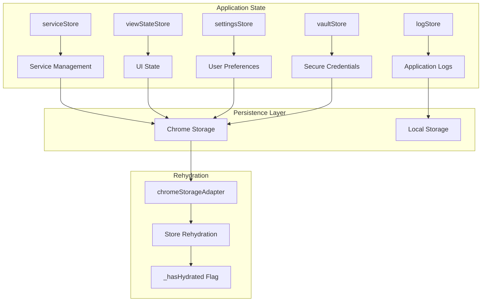

# State Management Architecture

## Agent Context
**For AI Agents**: Complete state management architecture using Zustand stores with Chrome storage persistence. Use this when working with application state, implementing data persistence, or handling store rehydration. Critical foundation document for all state-related development.

**Implementation Notes**: Contains functional patterns for 5 core stores (serviceStore, viewStateStore, settingsStore, vaultStore, logStore) with async rehydration, migration support, and error handling.
**Quality Requirements**: Keep store interfaces and patterns synchronized with actual implementation. Maintain accuracy of rehydration patterns and Chrome storage adapter.
**Integration Points**: Foundation for all persistent data, links to service architecture, security, and UI components that consume state.

---

## Quick Summary

Kai-CD uses Zustand for state management with a custom Chrome storage adapter for persistence. All stores follow a consistent pattern with async rehydration, error handling, and migration support. The system ensures data persistence across browser sessions while maintaining performance.

## Implementation Status

- ✅ **Complete**: Zustand store architecture with 5 core stores
- ✅ **Complete**: Chrome storage persistence adapter
- ✅ **Complete**: Async rehydration pattern with `_hasHydrated` flag
- ✅ **Complete**: Migration system for schema evolution
- ✅ **Complete**: Error handling and recovery mechanisms
- 🔄 **In Progress**: Performance optimizations for large datasets
- 📋 **Planned**: Distributed state for kOS compatibility

## Store Architecture Overview

### Core Store Structure



## Core Stores

### 1. **serviceStore** - Service Management

**Purpose**: Manages all external service integrations, configurations, and status

```typescript
interface ServiceState {
  services: Record<string, ServiceInstance>;
  activeService: string | null;
  isLoading: boolean;
  errors: Record<string, string>;
  _hasHydrated: boolean;
}

interface ServiceInstance {
  definition: ServiceDefinition;
  config: ServiceConfig;
  status: 'healthy' | 'unhealthy' | 'unknown';
  lastCheck: Date;
  capabilities: Capability[];
  credentials?: Record<string, string>;
}
```

**Key Actions**:
- `addService(definition, config)` - Register new service
- `removeService(serviceId)` - Remove service integration
- `updateServiceConfig(serviceId, config)` - Update service settings
- `setActiveService(serviceId)` - Switch active service
- `updateServiceStatus(serviceId, status)` - Update health status

**Location**: `src/store/serviceStore.ts`

### 2. **viewStateStore** - UI State Management

**Purpose**: Manages UI state, navigation, and view preferences

```typescript
interface ViewState {
  activeView: 'chat' | 'image' | 'settings' | 'security';
  sidebarOpen: boolean;
  theme: string;
  panelLayout: 'single' | 'split' | 'multi';
  chatHistory: Record<string, ChatMessage[]>;
  _hasHydrated: boolean;
}
```

**Key Actions**:
- `setActiveView(view)` - Navigate between main views
- `toggleSidebar()` - Show/hide sidebar
- `setPanelLayout(layout)` - Change interface layout
- `addChatMessage(serviceId, message)` - Store chat messages
- `clearChatHistory(serviceId?)` - Clear conversation history

**Location**: `src/store/viewStateStore.ts`

### 3. **settingsStore** - User Preferences

**Purpose**: Manages user configuration, preferences, and application settings

```typescript
interface SettingsState {
  theme: {
    colorScheme: string;
    customThemes: CustomTheme[];
    darkMode: boolean;
  };
  ai: {
    defaultModel: string;
    temperature: number;
    maxTokens: number;
    streamResponses: boolean;
  };
  ui: {
    language: string;
    notifications: boolean;
    autoSave: boolean;
    compactMode: boolean;
  };
  developer: {
    debugMode: boolean;
    logLevel: 'error' | 'warn' | 'info' | 'debug';
    showDevTools: boolean;
  };
  _hasHydrated: boolean;
}
```

**Key Actions**:
- `updateTheme(themeConfig)` - Change theme settings
- `updateAiSettings(settings)` - Configure AI behavior
- `updateUiSettings(settings)` - Adjust UI preferences
- `toggleDebugMode()` - Enable/disable developer features

**Location**: `src/store/settingsStore.ts`

### 4. **vaultStore** - Secure Credential Management

**Purpose**: Manages encrypted storage of service credentials and sensitive data

```typescript
interface VaultState {
  isUnlocked: boolean;
  credentials: Record<string, EncryptedCredential>;
  masterKeyHash: string;
  securitySettings: {
    autoLockTimeout: number;
    requirePasswordForAccess: boolean;
    enableBiometric: boolean;
  };
  _hasHydrated: boolean;
}

interface EncryptedCredential {
  serviceId: string;
  encryptedData: string;
  salt: string;
  createdAt: Date;
  lastUsed: Date;
}
```

**Key Actions**:
- `unlockVault(password)` - Decrypt and access credentials
- `lockVault()` - Secure vault and clear decrypted data
- `storeCredential(serviceId, credential)` - Encrypt and store
- `getCredential(serviceId)` - Decrypt and retrieve
- `updateSecuritySettings(settings)` - Configure security options

**Location**: `src/store/vaultStore.ts`

### 5. **logStore** - Application Logging

**Purpose**: Captures and manages application logs for debugging and monitoring

```typescript
interface LogState {
  logs: LogEntry[];
  maxLogs: number;
  logLevel: LogLevel;
  filters: {
    level: LogLevel[];
    source: string[];
    timeRange: [Date, Date];
  };
  _hasHydrated: boolean;
}

interface LogEntry {
  id: string;
  timestamp: Date;
  level: 'error' | 'warn' | 'info' | 'debug';
  source: string;
  message: string;
  data?: any;
}
```

**Key Actions**:
- `addLog(level, source, message, data?)` - Add new log entry
- `clearLogs()` - Remove all log entries
- `setLogLevel(level)` - Configure logging verbosity
- `exportLogs()` - Generate log export for debugging

**Location**: `src/store/logStore.ts`

## Chrome Storage Integration

### Custom Storage Adapter

The Chrome storage adapter provides seamless persistence for Zustand stores:

```typescript
// src/store/chromeStorage.ts
interface ChromeStorageAdapter {
  getItem: (name: string) => Promise<string | null>;
  setItem: (name: string, value: string) => Promise<void>;
  removeItem: (name: string) => Promise<void>;
}

const chromeStorageAdapter: ChromeStorageAdapter = {
  getItem: async (name: string) => {
    const result = await chrome.storage.local.get(name);
    return result[name] || null;
  },
  
  setItem: async (name: string, value: string) => {
    await chrome.storage.local.set({ [name]: value });
  },
  
  removeItem: async (name: string) => {
    await chrome.storage.local.remove(name);
  }
};
```

### Storage Configuration

Each store is configured with persistence:

```typescript
export const serviceStore = create<ServiceState>()(
  persist(
    (set, get) => ({
      // Store implementation
      services: {},
      activeService: null,
      isLoading: false,
      errors: {},
      _hasHydrated: false,
      
      // Actions
      addService: (definition, config) => {
        // Implementation
      },
      // ... more actions
    }),
    {
      name: 'service-store',
      storage: chromeStorageAdapter,
      onRehydrateStorage: () => (state) => {
        state?._hasHydrated = true;
        // Migration logic here if needed
      },
    }
  )
);
```

## Rehydration Pattern

### The `_hasHydrated` Flag

All stores use a consistent pattern for handling async rehydration:

```typescript
// In components, check rehydration before using store data
const Component: React.FC = () => {
  const hasHydrated = useServiceStore(state => state._hasHydrated);
  const services = useServiceStore(state => state.services);
  
  if (!hasHydrated) {
    return <LoadingSpinner />;
  }
  
  return (
    <div>
      {/* Use services data safely */}
    </div>
  );
};
```

### Migration Handling

Store migrations are handled during rehydration:

```typescript
const onRehydrateStorage = () => (state: ServiceState | undefined) => {
  if (state) {
    // Mark as hydrated
    state._hasHydrated = true;
    
    // Handle migrations
    if (!state.version || state.version < CURRENT_VERSION) {
      state = migrateServiceStore(state);
    }
    
    // URL migration example from memory
    if (state.services) {
      Object.values(state.services).forEach(service => {
        if (service.config.ipType === 'local' || service.config.ipType === 'remote') {
          const currentConfig = getConfigValue('networking.services');
          const newBaseUrl = generateServiceUrl(service.config.ipType, currentConfig);
          if (service.config.baseUrl !== newBaseUrl) {
            service.config.baseUrl = newBaseUrl;
          }
        }
      });
    }
  }
};
```

## State Management Patterns

### 1. **Immutable Updates**

All state updates use immutable patterns:

```typescript
// Correct: Immutable update
addService: (definition, config) => 
  set(state => ({
    services: {
      ...state.services,
      [definition.id]: {
        definition,
        config,
        status: 'unknown',
        capabilities: definition.capabilities
      }
    }
  })),

// Incorrect: Direct mutation
addService: (definition, config) => 
  set(state => {
    state.services[definition.id] = { definition, config }; // Don't do this
    return state;
  })
```

### 2. **Computed Values**

Use selectors for computed values:

```typescript
// Selector for healthy services
const useHealthyServices = () => 
  useServiceStore(state => 
    Object.values(state.services).filter(s => s.status === 'healthy')
  );

// Selector for services with specific capability
const useServicesWithCapability = (capability: Capability) =>
  useServiceStore(state =>
    Object.values(state.services).filter(s => 
      s.capabilities.includes(capability)
    )
  );
```

### 3. **Action Composition**

Complex operations compose multiple actions:

```typescript
// Complex action that updates multiple stores
const switchServiceAndClearHistory = async (serviceId: string) => {
  const serviceStore = useServiceStore.getState();
  const viewStateStore = useViewStateStore.getState();
  
  // Switch active service
  serviceStore.setActiveService(serviceId);
  
  // Clear chat history for previous service
  viewStateStore.clearChatHistory();
  
  // Update UI state
  viewStateStore.setActiveView('chat');
};
```

### 4. **Error Handling**

Consistent error handling across stores:

```typescript
updateServiceStatus: async (serviceId, status) => {
  try {
    set(state => ({
      services: {
        ...state.services,
        [serviceId]: {
          ...state.services[serviceId],
          status,
          lastCheck: new Date()
        }
      },
      errors: {
        ...state.errors,
        [serviceId]: undefined // Clear previous error
      }
    }));
  } catch (error) {
    set(state => ({
      errors: {
        ...state.errors,
        [serviceId]: error.message
      }
    }));
    
    // Log error
    useLogStore.getState().addLog('error', 'serviceStore', 
      `Failed to update service status: ${error.message}`, { serviceId, status });
  }
}
```

## Performance Considerations

### 1. **Selective Subscriptions**

Use specific selectors to minimize re-renders:

```typescript
// Good: Specific selector
const activeServiceId = useServiceStore(state => state.activeService);

// Less optimal: Full state subscription
const fullState = useServiceStore();
const activeServiceId = fullState.activeService;
```

### 2. **Debounced Updates**

Debounce frequent updates:

```typescript
import { debounce } from 'lodash';

// Debounced settings update
const debouncedUpdateSettings = debounce((settings) => {
  useSettingsStore.getState().updateAiSettings(settings);
}, 300);
```

### 3. **Storage Optimization**

Optimize what gets persisted:

```typescript
const persist = (config) => ({
  ...config,
  partialize: (state) => ({
    // Only persist essential data
    services: state.services,
    activeService: state.activeService,
    // Omit temporary state
    // isLoading: state.isLoading,
    // errors: state.errors,
  })
});
```

## Security Considerations

### 1. **Sensitive Data Handling**

Never store sensitive data in plaintext:

```typescript
// Correct: Encrypted storage
vaultStore.storeCredential(serviceId, credential);

// Incorrect: Plaintext storage
serviceStore.updateService(serviceId, { apiKey: 'plain-text-key' });
```

### 2. **State Isolation**

Keep sensitive state isolated:

```typescript
// Vault store automatically locks sensitive data
const isUnlocked = useVaultStore(state => state.isUnlocked);
const credentials = isUnlocked ? useVaultStore(state => state.credentials) : {};
```

## For AI Agents

### When to Use State Management
- ✅ Use when: Storing data that needs persistence across sessions
- ✅ Use when: Managing complex UI state or user preferences
- ✅ Use when: Coordinating state between multiple components
- ✅ Use when: Implementing features that require async data loading
- ❌ Don't use when: Managing local component state that doesn't need persistence

### Key Implementation Points

1. **Always check `_hasHydrated` flag** before using persisted state
2. **Use immutable update patterns** for all state modifications
3. **Handle errors gracefully** with proper error state management
4. **Follow the migration pattern** when changing store schemas
5. **Keep sensitive data in the vault store** with proper encryption

### Common Patterns

```typescript
// Safe state access with rehydration check
const Component: React.FC = () => {
  const hasHydrated = useServiceStore(state => state._hasHydrated);
  const services = useServiceStore(state => state.services);
  
  if (!hasHydrated) {
    return <div>Loading...</div>;
  }
  
  return <ServiceList services={services} />;
};

// Action with error handling
const handleServiceAction = async (serviceId: string) => {
  try {
    const result = await apiClient.request({
      serviceId,
      endpoint: 'health'
    });
    
    useServiceStore.getState().updateServiceStatus(serviceId, 'healthy');
  } catch (error) {
    useServiceStore.getState().updateServiceStatus(serviceId, 'unhealthy');
    useLogStore.getState().addLog('error', 'healthCheck', error.message);
  }
};
```

## Migration Considerations for kOS

### kOS-Ready Patterns
- **Store structure** → Can be distributed across agent mesh
- **Action patterns** → Map to agent message passing
- **Error handling** → Foundation for distributed error recovery
- **Migration system** → Supports schema evolution across agents

### Areas Requiring Evolution
- **Chrome storage dependency** → Distributed storage systems
- **Centralized state** → Agent-local state with synchronization
- **Direct store access** → Message-based state updates
- **Single-user model** → Multi-agent state coordination

## Related Documentation

- **Current**: [System Architecture](./01_system-architecture.md) - Overall system design
- **Current**: [Service Architecture](../services/01_service-architecture.md) - Service integration patterns
- **Future**: [Core Architecture](../../future/architecture/02_core-architecture.md) - kOS distributed state
- **Bridge**: [State Migration](../../bridge/06_state-migration.md) - Evolution strategy

## External References

- [Zustand Documentation](https://github.com/pmndrs/zustand)
- [Chrome Storage API](https://developer.chrome.com/docs/extensions/reference/storage/)
- [React State Management Patterns](https://react.dev/learn/managing-state)

---

