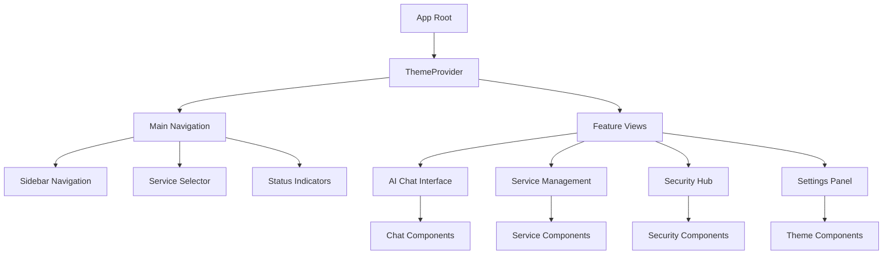
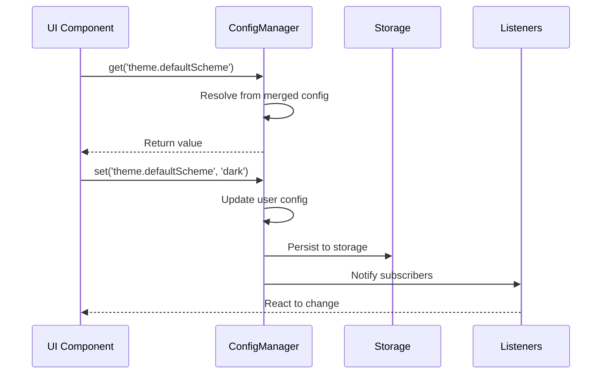
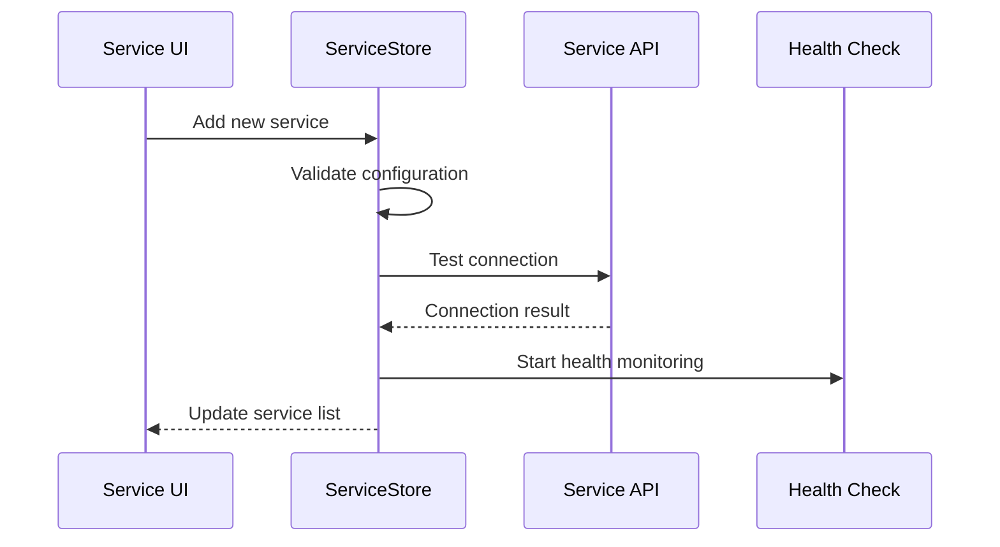

# 1. Architecture Overview

## Agent Context
**For AI Agents**: Complete architecture overview covering system design, component relationships, and architectural patterns. Use this when understanding system architecture, implementing architectural patterns, planning system components, or building architectural awareness. Essential foundation for all architectural work.

**Implementation Notes**: Contains comprehensive system architecture documentation, component relationship mapping, architectural pattern explanations, and design principle guidelines. Includes detailed architectural diagrams and system design patterns.
**Quality Requirements**: Keep architectural documentation and system design patterns synchronized with actual implementation. Maintain accuracy of component relationships and architectural pattern descriptions.
**Integration Points**: Foundation for system architecture, links to component design, system patterns, and development guidelines for comprehensive architectural understanding.

## 🏗️ **System Architecture**

Kai-CD follows a **feature-based modular architecture** designed for scalability, maintainability, and developer productivity. The system is organized around discrete features with shared infrastructure and clear separation of concerns.

## 📂 **Directory Structure**

```
src/
├── core/                          # Core application infrastructure
│   ├── config/                    # Centralized configuration management
│   │   ├── index.ts              # ConfigManager singleton with full API
│   │   ├── system.ts             # System default configuration
│   │   ├── types.ts              # Configuration type definitions
│   │   └── user.ts               # User override handling
│   ├── constants/                 # Application-wide constants
│   ├── types/                     # Core type definitions
│   └── utils/                     # Core utilities and helpers
├── features/                      # Feature-based organization
│   ├── ai-services/              # AI service management
│   │   ├── components/           # Service-specific UI components
│   │   ├── hooks/                # Service management hooks
│   │   ├── store/                # Service state management
│   │   ├── types/                # Service type definitions
│   │   └── utils/                # Service utilities
│   ├── security/                 # Security & cryptography
│   │   ├── components/           # Security UI components
│   │   ├── crypto/               # Cryptographic utilities
│   │   ├── vault/                # Vault management logic
│   │   └── utils/                # Security utilities
│   ├── themes/                   # Theme management system
│   │   ├── components/           # Theme UI components
│   │   │   ├── ThemeCustomizer.tsx
│   │   │   ├── ThemeCard.tsx
│   │   │   └── ThemeCreationForm.tsx
│   │   ├── manager/              # Theme business logic
│   │   │   └── themeManager.ts
│   │   ├── presets/              # Theme collections
│   │   │   ├── lightThemes.ts
│   │   │   ├── darkThemes.ts
│   │   │   └── developerThemes.ts
│   │   └── types/                # Theme type definitions
│   └── ui-shell/                 # Main UI framework
│       ├── layout/               # Layout components
│       ├── navigation/           # Navigation components
│       └── views/                # Main view components
├── shared/                       # Shared/reusable code
│   ├── components/               # Reusable UI component library
│   │   ├── forms/                # Form components (Input, Button)
│   │   ├── layout/               # Layout components
│   │   ├── feedback/             # Notifications, alerts
│   │   └── data-display/         # Tables, cards, lists
│   ├── hooks/                    # Reusable React hooks
│   ├── utils/                    # Shared utility functions
│   └── constants/                # Shared constants
├── platforms/                    # Platform-specific code
│   ├── chrome-extension/         # Chrome extension implementation
│   │   ├── background/           # Background service scripts
│   │   ├── popup/                # Browser action popup
│   │   ├── sidepanel/            # Chrome side panel
│   │   └── tab/                  # Main tab interface
│   └── web/                      # Future web platform support
└── assets/                       # Static assets
    ├── styles/                   # Global CSS and themes
    ├── icons/                    # Icon assets
    └── docs/                     # Documentation assets
```

---

## 🎯 **Architectural Principles**

### **1. Feature-First Organization**
Each major feature is self-contained with its own:
- UI components
- Business logic
- Type definitions  
- State management
- Utilities

**Benefits:**
- **Team scalability** - Multiple developers can work on different features
- **Code isolation** - Changes in one feature don't affect others
- **Clear ownership** - Each feature has defined boundaries

### **2. Shared Infrastructure**
Common functionality is centralized in `shared/` and `core/`:
- **Reusable UI components** prevent duplication
- **Core utilities** provide consistent behavior
- **Configuration management** centralizes settings

### **3. Platform Abstraction**
Platform-specific code is isolated in `platforms/`:
- **Chrome extension** implementation
- **Future web platform** support
- **Clean separation** between platform and business logic

---

## ⚙️ **Core Infrastructure**

### **Configuration Management**
**Location:** `src/core/config/`

The centralized configuration system provides:

```typescript
interface ConfigManager {
  // Initialize configuration system
  initialize(): Promise<void>;
  
  // Get complete configuration
  getConfig(): AppConfig;
  
  // Get specific value by path
  get<T>(path: string): T;
  
  // Set configuration value
  set(path: string, value: any): Promise<void>;
  
  // Update multiple values
  update(updates: DeepPartial<AppConfig>): Promise<void>;
  
  // Subscribe to changes
  subscribe(listener: (event: ConfigUpdateEvent) => void): () => void;
  
  // Import/export for backup
  export(): ConfigWithMetadata;
  import(config: Partial<AppConfig>): Promise<void>;
}
```

**Features:**
- **Hierarchical loading** (system defaults → user overrides → merged config)
- **Type-safe access** with full TypeScript support
- **Validation** with error and warning reporting
- **Change notifications** for reactive updates
- **Persistent storage** with Chrome storage API

### **State Management**
**Pattern:** Zustand with persistent middleware

**Core Stores:**
- `serviceStore` - AI service management and health monitoring
- `viewStateStore` - UI state and active selections
- `settingsStore` - User preferences and configuration
- `vaultStore` - Secure credential storage
- `logStore` - Application logging and diagnostics

**Storage Strategy:**
- **Chrome Storage API** for extension persistence
- **Automatic rehydration** with loading states
- **Optimistic updates** for responsive UI

---

## 🧩 **Component Architecture**

### **Component Hierarchy**



### **Shared Component Library**
**Location:** `src/shared/components/`

**Form Components:**
```typescript
// Reusable input with validation
<Input
  label="API Key"
  type="password"
  error={validationError}
  hint="Enter your service API key"
  leftIcon={<KeyIcon />}
/>

// Multi-variant button
<Button
  variant="primary"
  size="lg"
  loading={isSubmitting}
  leftIcon={<SaveIcon />}
>
  Save Configuration
</Button>
```

**Feedback Components:**
```typescript
// Notification system
<Alert
  type="success"
  title="Configuration Saved"
  message="Your settings have been updated successfully"
  dismissible
  onDismiss={() => setShowAlert(false)}
/>
```

---

## 🔄 **Data Flow Architecture**

### **Configuration Flow**


### **Service Management Flow**


---

## 🚀 **Performance Architecture**

### **Code Splitting Strategy**
- **Feature-based chunks** for lazy loading
- **Shared vendor bundles** for common dependencies
- **Dynamic imports** for heavy features

### **Bundle Optimization**
```typescript
// Lazy loading example
const SecurityHub = lazy(() => import('@features/security/components/SecurityHub'));
const ThemeCustomizer = lazy(() => import('@features/themes/components/ThemeCustomizer'));
```

### **Caching Strategy**
- **Configuration caching** in memory with persistence
- **Service status caching** with TTL
- **Theme asset caching** for fast switching

---

## 🔒 **Security Architecture**

### **Data Protection**
- **AES-256 encryption** for sensitive data
- **Secure storage** using Chrome storage API
- **Key derivation** with PBKDF2 and high iteration counts

### **API Security**
- **Credential isolation** in secure vault
- **Request validation** and sanitization
- **Error handling** without information leakage

### **Privacy Protection**
- **Local data storage** (no external servers)
- **Encrypted backups** for data export
- **Secure communication** with TLS verification

---

## 🛠️ **Development Architecture**

### **Build System**
- **Vite** for fast development and optimized builds
- **TypeScript** for type safety and developer experience
- **ESLint/Prettier** for code quality and consistency

### **Testing Strategy**
- **Unit tests** for utilities and business logic
- **Component tests** for UI behavior
- **Integration tests** for feature workflows

### **Type Safety**
- **Strict TypeScript** configuration
- **Comprehensive type definitions** for all APIs
- **Runtime validation** for external data

---

## 📊 **Metrics & Monitoring**

### **Performance Metrics**
- **Bundle size tracking** with build reports
- **Component render performance** monitoring
- **API response time** measurement

### **Usage Analytics**
- **Feature usage** tracking (privacy-preserving)
- **Error reporting** with stack traces
- **User journey** analysis for UX optimization

---

## 🔮 **Future Architecture**

### **Planned Enhancements**
- **Plugin system** for third-party extensions
- **Multi-platform support** (web, desktop)
- **Real-time collaboration** features
- **Advanced AI integrations**

### **Scalability Roadmap**
- **Micro-frontend architecture** for large teams
- **Event-driven communication** between features
- **Service worker** optimization for offline support
- **Progressive Web App** capabilities

---

