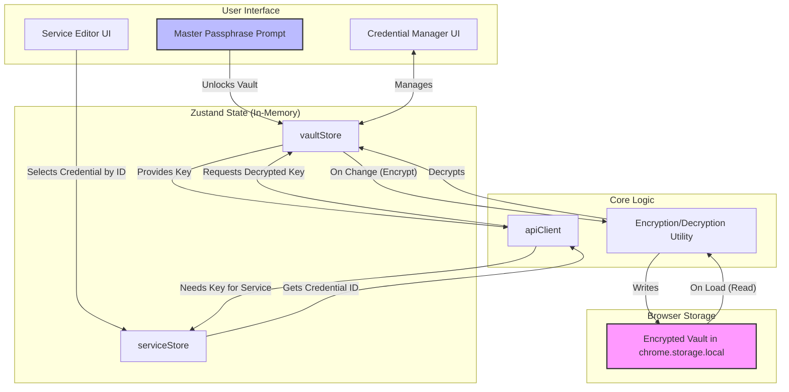

# 08: Credential & Vault Management

## Agent Context
**For AI Agents**: Complete credential and vault management documentation covering secure storage, authentication systems, and credential handling patterns. Use this when implementing secure storage, understanding authentication flows, planning credential management, or building secure credential systems. Essential foundation for all security and credential work.

**Implementation Notes**: Contains credential management patterns, secure vault implementation, authentication system design, and security best practices. Includes detailed security architecture and credential handling mechanisms.
**Quality Requirements**: Keep credential management and security patterns synchronized with actual implementation. Maintain accuracy of security mechanisms and credential handling procedures.
**Integration Points**: Foundation for security systems, links to authentication flows, secure storage, and security frameworks for comprehensive credential management coverage.

## 1. Introduction

As the application's capabilities expand, managing sensitive information like API keys and bearer tokens becomes a critical security challenge. The initial approach of storing these secrets in the configuration system, while better than hardcoding, is neither scalable nor sufficiently secure.

To address this, we will implement a centralized, encrypted credential vault inspired by best-in-class, zero-knowledge systems like [Bitwarden](https://github.com/bitwarden). This architecture ensures that sensitive user credentials are secure, reusable, and managed in a user-friendly way.

## 2. Core Principles

The vault's design is guided by three fundamental security principles:

-   **Zero-Knowledge Encryption**: The storage backend (`chrome.storage.local`) will only ever contain a fully encrypted blob of data. At no point will the unencrypted master passphrase or the decrypted vault contents be persisted. The "server" (in this case, the storage API) is blind to the user's secrets.
-   **Client-Side Cryptography**: All cryptographic operations—specifically encryption and decryption—happen exclusively on the user's device within the context of the running extension. Secrets are only ever held in memory in their decrypted form, and only when the vault is explicitly unlocked.
-   **Strong, Standard Cryptography**: We will use industry-standard cryptographic libraries (`crypto-js`) and algorithms.
    -   **Encryption**: AES-256 will be used for symmetric encryption of the vault data.
    -   **Key Derivation**: PBKDF2 will be used to derive a strong encryption key from the user's master passphrase. This significantly increases the cost of brute-force attacks.

## 3. Architectural Overview

The following diagram illustrates the data flow for the proposed vault system:

## 4. Key Components

-   **`vaultStore.ts`**: A new Zustand store that acts as the central hub for the vault.
    -   **State**: Manages the vault's status (`LOCKED`, `UNLOCKED`, `UNSET`), the master passphrase (in-memory only), the encrypted vault data, and the decrypted credentials (in-memory only).
    -   **Actions**: Exposes methods like `lock()`, `unlock(password)`, `addCredential(credential)`, `updateCredential(id, credential)`, and `deleteCredential(id)`.

-   **`crypto.ts`**: A utility module that abstracts away the `crypto-js` library.
    -   **`encrypt(plaintext, password)`**: Takes plaintext data and a password, derives a key using PBKDF2, and returns an AES-256 encrypted string.
    -   **`decrypt(ciphertext, password)`**: Takes the encrypted string and the password, re-derives the key, and returns the decrypted plaintext.

-   **`VaultManager.tsx`**: A new UI component that will serve as the primary interface for the vault. It will be responsible for:
    -   **Setup**: If the vault is `UNSET`, it will guide the user through creating a master passphrase. This screen will include a **Diceware passphrase generator** to help the user create a strong, memorable phrase.
    -   **Unlocking**: If the vault is `LOCKED`, it will present a simple form for the user to enter their passphrase to unlock the vault for the session.

-   **`CredentialManager.tsx`**: A dedicated view where users can see, add, edit, and delete the credentials stored within their vault after it has been unlocked.

-   **`ServiceEditor.tsx` (Refactored)**: The existing service editor will be modified. Instead of a text field for an API key, it will have a dropdown that allows the user to select a pre-existing credential from the `vaultStore`. The service instance will only store the `credentialId`.

## 5. Phased Implementation Plan

### Phase 1: Core Vault Functionality (Current Scope)
1.  Install `crypto-js` and `diceware` dependencies.
2.  Create the `vaultStore` and `crypto.ts` utility.
3.  Build the `VaultManager.tsx` component for setup and unlocking.
4.  Integrate the `VaultManager` as a "gatekeeper" for the application.
5.  Create the `CredentialManager.tsx` UI for managing credentials.
6.  Refactor the `serviceStore` and `ServiceDefinition` types to use `credentialId` instead of storing secrets.
7.  Update the `ServiceEditor` UI to use the credential selection dropdown.
8.  Update the `apiClient` to fetch credentials from the `vaultStore` before making requests.

### Phase 2: Future Enhancements
Once the core vault is stable, its functionality can be expanded to become a full-fledged secret management solution within the application:
-   **Secure Notes**: Add a new credential type for storing encrypted text.
-   **Login/Password Items**: Store standard website logins.
-   **Encrypted File Vault**: Allow users to upload and encrypt small, sensitive files.
-   **Passkey Support**: Integrate WebAuthn for managing passkeys.
