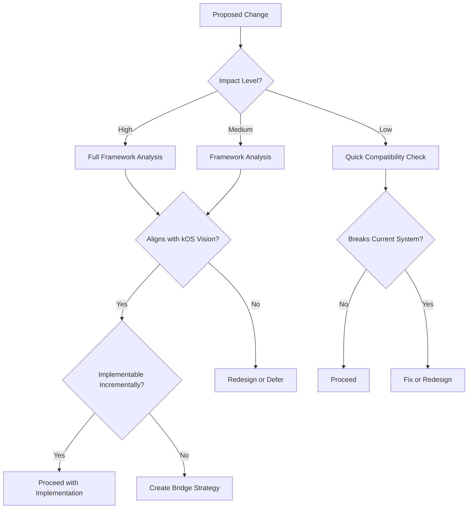

# Architectural Decision Framework

## Agent Context
**For AI Agents**: Complete architectural decision framework for making design decisions that align current implementation with kOS vision. Use this when making architectural decisions, planning feature implementations, understanding decision criteria, or ensuring alignment between current and future systems. Critical guide for all architectural decision-making work.

**Implementation Notes**: Contains decision-making framework, evaluation criteria, alignment strategies, and practical guidance for bridging current Kai-CD implementation with future kOS architecture. Includes decision matrices and evaluation patterns.
**Quality Requirements**: Keep decision framework and evaluation criteria synchronized with actual architectural evolution. Maintain accuracy of alignment strategies and decision-making processes.
**Integration Points**: Foundation for all architectural decisions, links to bridge strategy, system architecture, and future evolution planning for comprehensive decision guidance.

---

> **Agent Context**: Essential decision-making framework for maintaining kOS compatibility  
> **Implementation**: ✅ Complete framework ready for immediate use  
> **Use When**: Making any architectural, design, or implementation decision

## Quick Summary

This framework helps AI agents and developers make decisions that keep the current Kai-CD system working while moving incrementally toward the kOS vision. Every significant decision should be evaluated through this lens.

## Decision Matrix

### Impact Assessment

Before making any change, assess its impact:

| Impact Level | Description | Examples | Decision Process |
|--------------|-------------|----------|------------------|
| 🔴 **High** | Affects overall architecture | Protocol changes, state management, security model | Full framework analysis required |
| 🟡 **Medium** | Affects multiple components | New service types, UI patterns, data formats | Framework analysis recommended |
| 🟢 **Low** | Isolated to single component | Bug fixes, minor UI changes, config updates | Quick compatibility check |

### Decision Tree



## The Five-Factor Analysis

For medium to high-impact decisions, evaluate against these factors:

### 1. **kOS Vision Alignment** 🌟
- Does this move us toward the distributed AI mesh architecture?
- Is this compatible with the multi-agent framework?
- Does this support the Kind Link Protocol (KLP) vision?
- Will this work in a decentralized environment?

**Examples:**
- ✅ Adding agent-to-agent communication capabilities
- ✅ Implementing service discovery patterns
- ❌ Hardcoding centralized service dependencies  
- ❌ Creating Chrome-extension-only features

### 2. **Current System Compatibility** 🏗️
- Does this break existing functionality?
- Can this be implemented without major refactoring?
- Are existing patterns and APIs preserved?
- Will current users experience disruption?

**Examples:**
- ✅ Adding new service definitions using existing patterns
- ✅ Extending authentication without breaking current auth
- ❌ Changing core state management patterns
- ❌ Breaking existing service integrations

### 3. **Incremental Implementation** 🔄
- Can this be built in small, testable steps?
- Are there clear rollback points if issues arise?
- Can partial implementation provide value?
- Does this create technical debt?

**Examples:**
- ✅ Adding protocol support alongside existing APIs
- ✅ Implementing new features as optional capabilities
- ❌ Requiring complete system rewrite
- ❌ All-or-nothing architectural changes

### 4. **Bridge Compatibility** 🌉
- Does this create a clear path to kOS migration?
- Can this coexist with future kOS components?
- Are data formats forward-compatible?
- Will this ease or complicate future migration?

**Examples:**
- ✅ Using standard message formats that work with KLP
- ✅ Implementing interfaces that agents can adopt
- ❌ Creating proprietary formats or protocols
- ❌ Tight coupling to Chrome extension APIs

### 5. **Development Efficiency** ⚡
- Does this leverage existing patterns and code?
- Will this reduce or increase maintenance burden?
- Can this be tested and validated easily?
- Does this improve developer experience?

**Examples:**
- ✅ Extending proven ServiceDefinition patterns
- ✅ Building on established state management
- ❌ Creating entirely new patterns from scratch
- ❌ Increasing system complexity unnecessarily

## Decision Categories and Guidelines

### Service Integration Decisions

#### New Service Types
```yaml
Decision: Adding support for a new type of AI service
Framework Application:
  kOS Alignment: ✅ Services are core to kOS architecture
  Compatibility: ✅ Use ServiceDefinition pattern
  Incremental: ✅ Add as new capability type
  Bridge: ✅ Ensure service can work with KLP
  Efficiency: ✅ Leverage existing patterns
Result: Proceed with ServiceDefinition extension
```

#### Authentication Changes
```yaml
Decision: Implementing OAuth2 flow for services
Framework Application:
  kOS Alignment: 🤔 How does this work with decentralized identity?
  Compatibility: ✅ Can be added to existing auth system
  Incremental: ✅ Optional for services that need it
  Bridge: ⚠️ May need DID integration path
  Efficiency: 🤔 Adds complexity but enables more services
Result: Implement with future DID migration plan
```

### Architecture Decisions

#### State Management Changes
```yaml
Decision: Switching from Zustand to Redux
Framework Application:
  kOS Alignment: ❓ Doesn't directly relate to kOS vision
  Compatibility: ❌ Major breaking change
  Incremental: ❌ Requires complete rewrite
  Bridge: ❓ No clear benefit for kOS migration
  Efficiency: ❌ Massive development effort
Result: Reject - maintain Zustand, consider kOS state needs
```

#### Protocol Implementation
```yaml
Decision: Adding basic KLP message support
Framework Application:
  kOS Alignment: ✅ Core protocol for kOS
  Compatibility: ✅ Can coexist with current APIs
  Incremental: ✅ Start with basic message passing
  Bridge: ✅ Direct path to full kOS integration
  Efficiency: 🤔 New code but strategic investment
Result: Proceed with basic implementation
```

### UI/UX Decisions

#### Multi-Platform Support
```yaml
Decision: Creating mobile-responsive interfaces
Framework Application:
  kOS Alignment: ✅ kOS targets multiple platforms
  Compatibility: ✅ Progressive enhancement approach
  Incremental: ✅ Can improve existing components gradually
  Bridge: ✅ Prepares for mobile kOS deployment
  Efficiency: ✅ Uses responsive design patterns
Result: Proceed with responsive improvements
```

## Decision Templates

### For AI Agents

When making code changes, use this template:

```markdown
## Decision Analysis: [Brief Description]

**Impact Level**: High/Medium/Low
**Decision Type**: Service/Architecture/UI/Security

### Five-Factor Analysis
1. **kOS Alignment**: [Assessment and reasoning]
2. **Compatibility**: [Impact on current system]
3. **Incremental**: [Implementation approach]
4. **Bridge**: [Future migration considerations]
5. **Efficiency**: [Development cost/benefit]

### Recommendation
- [ ] Proceed as planned
- [ ] Proceed with modifications: [specify]
- [ ] Defer until: [conditions]
- [ ] Reject because: [reasoning]

### Implementation Plan
1. [Step 1]
2. [Step 2]
3. [Step 3]

### Monitoring Points
- [What to watch for during implementation]
```

### For Human Developers

When proposing architectural changes:

```markdown
## Architectural Decision Record: [Title]

**Status**: Proposed/Accepted/Rejected/Superseded
**Date**: YYYY-MM-DD
**Deciders**: [List of people involved]

### Context
[What is the issue that we're seeing that is motivating this decision?]

### Decision
[What is the change that we're proposing or have agreed to implement?]

### kOS Compatibility Analysis
[How does this align with the kOS vision and bridge strategy?]

### Consequences
**Positive:**
- [Positive consequence 1]
- [Positive consequence 2]

**Negative:**
- [Negative consequence 1]  
- [Negative consequence 2]

**Neutral:**
- [Neutral consequence 1]

### Implementation Strategy
[How will this be implemented incrementally?]

### Migration Path
[How does this prepare for or complicate kOS migration?]
```

## Common Decision Scenarios

### Scenario 1: Adding Vector Database Support

**Decision**: Integrate Chroma/Qdrant for embeddings and RAG

**Analysis**:
- 🌟 **kOS Alignment**: ✅ Knowledge management is core to kOS
- 🏗️ **Compatibility**: ✅ Can add as new service type
- 🔄 **Incremental**: ✅ Start with basic search, expand features
- 🌉 **Bridge**: ✅ Vector stores align with agent memory systems
- ⚡ **Efficiency**: ✅ Uses existing ServiceDefinition pattern

**Recommendation**: Proceed with vector database integration using ServiceDefinition pattern

### Scenario 2: Implementing Real-time Communication

**Decision**: Add WebSocket support for real-time agent communication

**Analysis**:
- 🌟 **kOS Alignment**: ✅ Essential for multi-agent coordination  
- 🏗️ **Compatibility**: 🤔 New communication layer needed
- 🔄 **Incremental**: ✅ Can start with simple message passing
- 🌉 **Bridge**: ✅ Foundation for KLP implementation
- ⚡ **Efficiency**: 🤔 Moderate complexity but strategic value

**Recommendation**: Proceed with WebSocket foundation, design for KLP compatibility

### Scenario 3: Chrome Extension Specific Features

**Decision**: Add Chrome bookmark integration for AI-powered bookmark management

**Analysis**:
- 🌟 **kOS Alignment**: ❌ Chrome-specific, doesn't work in distributed kOS
- 🏗️ **Compatibility**: ✅ Easy to add to current system
- 🔄 **Incremental**: ✅ Simple implementation
- 🌉 **Bridge**: ❌ Creates platform dependency
- ⚡ **Efficiency**: ✅ Low effort, high user value

**Recommendation**: Implement as optional module with abstraction layer for future multi-platform support

## For AI Agents: Quick Decision Guide

### High-Level Decisions (Use Full Framework)
- New service types or protocols
- Authentication/security changes
- State management modifications
- Cross-cutting architectural changes

### Medium-Level Decisions (Framework Analysis)
- New UI components or patterns
- Data format changes
- Integration with external systems
- Performance optimizations

### Low-Level Decisions (Quick Check)
- Bug fixes that don't change APIs
- Minor UI improvements
- Configuration updates
- Documentation changes

### Red Flags (Stop and Analyze)
- ❌ Hardcoding Chrome extension dependencies
- ❌ Creating proprietary communication protocols
- ❌ Tight coupling between unrelated components
- ❌ Breaking changes to established APIs
- ❌ Ignoring established patterns for "better" solutions

### Green Lights (Usually Safe to Proceed)
- ✅ Following existing ServiceDefinition patterns
- ✅ Adding new capabilities to existing frameworks
- ✅ Improving error handling and logging
- ✅ Enhancing existing UI without breaking functionality
- ✅ Adding configuration options without changing defaults

## Decision Log and Tracking

All significant decisions should be documented in the Bridge Strategy docs:

- **High Impact**: Full ADR (Architectural Decision Record)
- **Medium Impact**: Decision summary with reasoning
- **Patterns**: Document recurring decisions as reusable patterns

This creates a knowledge base for future agents and developers.

---

## Remember: Every Decision Shapes kOS

Your decisions today determine whether kOS becomes reality or remains a distant vision. Use this framework to ensure every choice moves us closer to the distributed AI mesh while keeping the current system stable and valuable.

