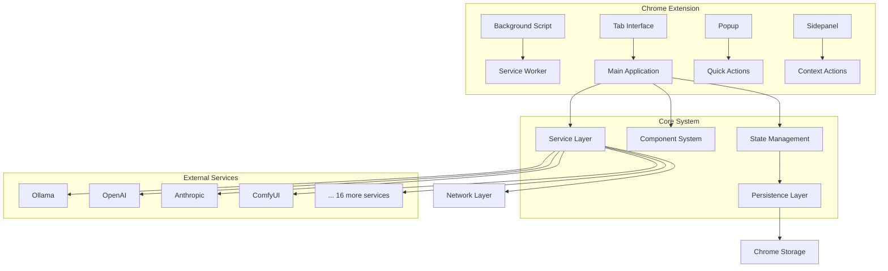
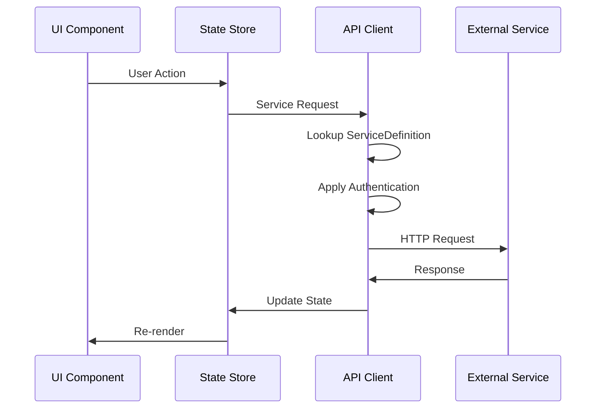
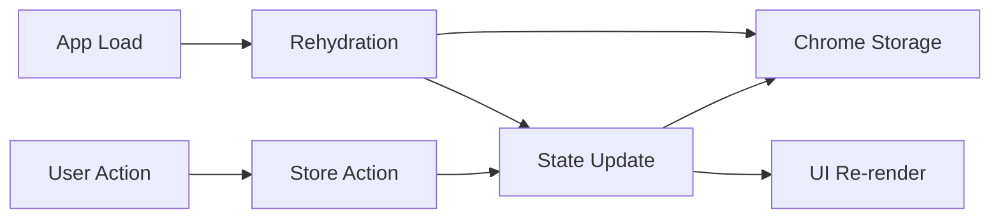

# Kai-CD System Architecture

## Agent Context
**For AI Agents**: Complete architectural overview of the working Kai-CD Chrome extension system. Use this when understanding the overall system structure, making architectural decisions, planning integrations, or implementing major changes. Essential reference for understanding how all components work together.

**Implementation Notes**: Contains production Chrome extension architecture with multi-view system, service connector pattern, state management, and security layers. All diagrams and code examples reflect actual working implementation.
**Quality Requirements**: Keep architectural descriptions synchronized with actual implementation. Maintain accuracy of data flows, component relationships, and service integration patterns.
**Integration Points**: Foundation for understanding entire system, links to state management, service architecture, component system, and security implementation.

---

## Quick Summary

Kai-CD is a Chrome extension that provides a unified interface for multiple AI services. Built with React, TypeScript, and Zustand, it features a service connector architecture, secure credential management, and dynamic UI rendering based on service capabilities.

## Implementation Status

- ✅ **Complete**: Chrome extension framework, multi-view architecture
- ✅ **Complete**: Service connector system with 20+ integrations
- ✅ **Complete**: State management with persistence
- ✅ **Complete**: Security and credential management
- ✅ **Complete**: Dynamic UI system based on capabilities
- 🔄 **In Progress**: Enhanced error handling and monitoring
- 📋 **Planned**: Mobile companion app, kOS compatibility layer

## High-Level Architecture

### System Overview



## Core Architecture Layers

### 1. **Extension Framework Layer**

The Chrome extension provides multiple entry points and contexts:

#### Tab Interface (`src/tab/`)
- **Primary interface** for full AI interactions
- Multi-panel layout with service selector
- Full feature access including chat, image generation, settings
- **Entry Point**: `tab.html` → `src/tab/main.tsx` → `Tab.tsx`

#### Popup Interface (`src/popup/`)
- **Quick access** via browser action button  
- Simplified interface for common tasks
- Service status overview and quick settings
- **Entry Point**: `popup.html` → `src/popup/main.tsx` → `Popup.tsx`

#### Sidepanel Interface (`src/sidepanel/`)
- **Context-aware** interface in Chrome's side panel
- Website-specific AI assistance
- Streamlined for focused tasks
- **Entry Point**: `sidepanel.html` → `src/sidepanel/main.tsx` → `Sidepanel.tsx`

#### Background Script (`src/background/`)
- Service worker for extension lifecycle
- Handles installation, updates, and background tasks
- Manages extension permissions and API access

### 2. **Application Core Layer**

#### State Management (`src/store/`)
Built on Zustand with Chrome storage persistence:

```typescript
// Core stores
serviceStore      // Service management and configuration
viewStateStore    // UI state and navigation  
settingsStore     // User preferences and configuration
vaultStore        // Secure credential management
logStore          // Application logging and debugging
```

**Key Pattern**: All stores use the `_hasHydrated` flag for async rehydration from Chrome storage.

#### Component System (`src/components/`)
React components organized by functionality:

```typescript
// Dynamic capability rendering
CapabilityUI      // Routes to appropriate service UI
LlmChatView       // Chat interface for language models
ImageGenerationView // Image creation interface
ServiceSelector   // Service selection and status
ThemeProvider     // Theme system and customization
```

#### Service Layer (`src/connectors/` + `src/utils/apiClient.ts`)
Universal service integration system:

```typescript
ServiceDefinition // Rich service metadata
apiClient         // Universal HTTP client
Authentication    // Credential management
HealthChecking    // Service monitoring
```

### 3. **Service Integration Layer**

#### Service Definition Pattern
Each service is described by a comprehensive configuration:

```typescript
interface ServiceDefinition {
  id: string;                    // Unique identifier
  name: string;                  // Display name
  capabilities: Capability[];    // What the service can do
  baseUrl: string;              // API endpoint
  authentication: AuthConfig;   // How to authenticate
  endpoints: EndpointMap;       // API endpoint definitions
  healthCheck?: HealthConfig;   // How to check if service is up
}
```

#### Universal API Client
Single client handles all service requests:
- **Dynamic request construction** from ServiceDefinition
- **Authentication handling** (API keys, bearer tokens, custom headers)
- **Error handling and retry logic**
- **Response standardization** across different APIs

#### Service Registry
Currently integrated services include:
- **LLM Services**: Ollama, OpenAI, Anthropic, Hugging Face, LLaMA.cpp
- **Image Generation**: ComfyUI, A1111, Midjourney
- **Vector Databases**: Chroma, Qdrant, Milvus
- **Workflow**: n8n integration
- **Cloud Storage**: Dropbox integration

### 4. **Security and Storage Layer**

#### Vault System (`src/components/security/`)
Comprehensive security framework:
- **Encrypted credential storage** in Chrome storage
- **Password generation** with multiple algorithms
- **Cryptographic tools** for hashing and encoding
- **Security audit** capabilities

#### Chrome Storage Integration
Custom persistence adapter (`src/store/chromeStorage.ts`):
- **Automatic serialization/deserialization**
- **Storage quota management**
- **Migration support** for schema changes
- **Backup and restore** functionality

## Data Flow Architecture

### Request Flow


### State Management Flow


## Key Architectural Patterns

### 1. **Service Definition Pattern**
- **Single source of truth** for each service integration
- **Declarative configuration** drives dynamic behavior
- **Extensible** - new services added by creating definition files
- **Consistent** - all services follow same integration pattern

### 2. **Capability-Driven UI**
- **Services declare capabilities** (`llm_chat`, `image_generation`, etc.)
- **UI automatically adapts** based on active service capabilities
- **Dynamic component loading** for different service types
- **Consistent UX** across different service categories

### 3. **Universal Client Pattern**
- **Single HTTP client** handles all external service requests
- **Configuration-driven** request construction
- **Centralized** authentication, error handling, and logging
- **Extensible** authentication patterns for different services

### 4. **Persistent State with Rehydration**
- **All critical state** persisted to Chrome storage
- **Async rehydration** on app startup
- **Migration support** for schema evolution
- **Backup/restore** capabilities

### 5. **Multi-Context Architecture**
- **Same core components** used across tab, popup, sidepanel
- **Context-aware rendering** based on available space
- **Shared state** across all contexts
- **Consistent behavior** regardless of entry point

## Technical Implementation Details

### Build System
- **Vite** for fast development and optimized builds
- **TypeScript** for type safety and developer experience
- **TailwindCSS** for consistent styling
- **Chrome Extension Manifest V3** compliance

### State Management Implementation
```typescript
// Example store structure
interface ServiceState {
  services: Record<string, ServiceInstance>;
  activeService: string | null;
  isLoading: boolean;
  errors: Record<string, string>;
  _hasHydrated: boolean;
}

// Persistence with Chrome storage
const serviceStore = create<ServiceState>()(
  persist(
    (set, get) => ({
      // ... store implementation
    }),
    {
      name: 'service-store',
      storage: chromeStorageAdapter,
    }
  )
);
```

### Component Organization
```typescript
// Dynamic capability rendering
const CapabilityUI: React.FC = () => {
  const activeService = useServiceStore(s => s.activeService);
  const service = useServiceStore(s => s.services[activeService]);
  
  return (
    <div>
      {service.capabilities.includes('llm_chat') && <LlmChatView />}
      {service.capabilities.includes('image_generation') && <ImageGenerationView />}
      {/* Dynamic rendering based on capabilities */}
    </div>
  );
};
```

## Performance Characteristics

### Strengths
- **Fast startup** due to efficient state rehydration
- **Responsive UI** with React and optimized re-renders
- **Efficient networking** with request caching and retry logic
- **Small bundle size** with code splitting and tree shaking

### Scalability Considerations
- **Service definitions** can be loaded dynamically
- **Component system** supports lazy loading
- **State management** handles large numbers of services
- **Storage system** manages quota and cleanup

## Security Architecture

### Credential Management
- **Never store credentials in plaintext**
- **Encryption at rest** in Chrome storage
- **Secure transmission** with HTTPS only
- **Audit trail** for credential access

### Network Security
- **HTTPS only** for all external requests
- **CORS handling** for browser security
- **Request validation** before sending
- **Response sanitization** after receiving

### Extension Security
- **Minimal permissions** in manifest
- **Content Security Policy** enforcement
- **No eval() or unsafe operations**
- **Secure coding practices** throughout

## For AI Agents

### When to Use This Architecture
- ✅ Use when: Understanding system-wide behavior and interactions
- ✅ Use when: Making changes that affect multiple components
- ✅ Use when: Adding new service integrations or capabilities
- ✅ Use when: Planning performance optimizations or refactoring
- ❌ Don't use when: Making isolated component changes or bug fixes

### Key Implementation Points

1. **Follow the Service Definition pattern** for all new services
2. **Use the universal apiClient** instead of custom HTTP clients  
3. **Leverage the state management system** for all persistent data
4. **Implement capability-based UI** for dynamic service rendering
5. **Maintain Chrome extension security best practices**

### Common Integration Patterns

```typescript
// Adding a new service
export const newServiceDefinition: ServiceDefinition = {
  id: 'new-service',
  name: 'New Service',
  capabilities: ['llm_chat'],
  baseUrl: 'https://api.example.com',
  authentication: {
    type: 'bearer',
    headerName: 'Authorization'
  },
  endpoints: {
    chat: {
      path: '/chat',
      method: 'POST',
      requestSchema: ChatRequestSchema
    }
  }
};

// Using the service
const response = await apiClient.request({
  serviceId: 'new-service',
  endpoint: 'chat',
  data: { message: 'Hello' }
});
```

## Migration Considerations for kOS

### kOS-Ready Components
- **Service Definition pattern** → Can be extended for agent services
- **Capability system** → Maps to agent capabilities  
- **State management** → Can be distributed across agents
- **Security framework** → Foundation for agent identity

### Areas Requiring Evolution
- **Chrome extension dependency** → Multi-platform deployment
- **Centralized state** → Distributed agent state
- **HTTP-only communication** → Agent messaging protocols
- **Single-user model** → Multi-agent collaboration

## Related Documentation

- **Current**: [State Management](./02_state-management.md) - Detailed store implementation
- **Current**: [Service Architecture](../services/01_service-architecture.md) - Service integration patterns
- **Current**: [Component System](../components/01_component-system.md) - UI component organization
- **Future**: [kOS Architecture](../../future/architecture/01_system-overview.md) - Target architecture
- **Bridge**: [Evolution Strategy](../../bridge/01_evolution-strategy.md) - Migration approach

## External References

- [Chrome Extension Developer Guide](https://developer.chrome.com/docs/extensions/)
- [React Architecture Patterns](https://react.dev/learn/thinking-in-react)
- [Zustand State Management](https://github.com/pmndrs/zustand)
- [Vite Build Tool](https://vitejs.dev/guide/)

---

