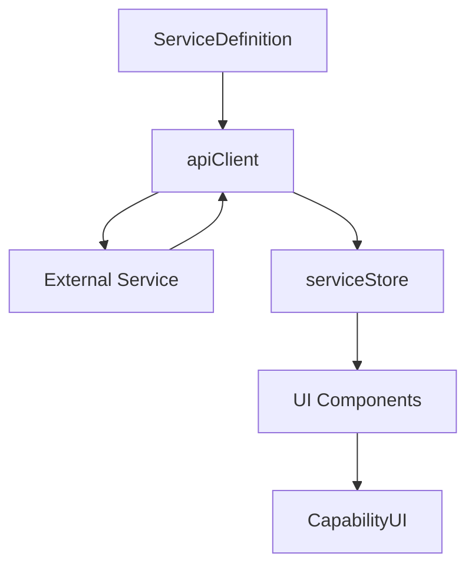

# Service Architecture (Current Implementation)

## Agent Context
**For AI Agents**: Complete service architecture documentation covering current Kai-CD service connector system and evolution to future kOS service architecture. Use this when understanding service integration patterns, implementing service connectors, planning service architecture, or building service communication systems. Essential foundation for all service-related development work.

**Implementation Notes**: Contains working service connector patterns, service definition schemas, API client integration, and service management systems. Includes production-ready service architecture used for 20+ service integrations.
**Quality Requirements**: Keep service architecture patterns and integration methods synchronized with actual implementation. Maintain accuracy of service connector schemas and communication patterns.
**Integration Points**: Foundation for all service integration, links to service registry, API client system, and future distributed service architecture for comprehensive service management.

---

> **Agent Context**: Complete service connector system - use this pattern for all service integrations  
> **Implementation**: ✅ Complete - 20+ services working with this architecture  
> **Use When**: Adding any new external service integration to Kai-CD

## Quick Summary

Kai-CD uses a sophisticated service connector architecture where each external service (Ollama, OpenAI, ComfyUI, etc.) is defined through a rich `ServiceDefinition` that describes capabilities, authentication, and API patterns. A universal `apiClient` handles all requests dynamically.

## Implementation Status

- ✅ **Complete**: ServiceDefinition pattern, universal apiClient, authentication handling
- ✅ **Complete**: 20+ service integrations working in production
- ✅ **Complete**: Dynamic capability detection and UI rendering
- 🔄 **In Progress**: Enhanced error handling and retry logic
- 📋 **Planned**: Service health monitoring and auto-recovery

## Architecture Overview

### Core Components

#### 1. ServiceDefinition System
Located in `src/connectors/definitions/`, each service has a definition file:

```typescript
interface ServiceDefinition {
  id: string;
  name: string;
  description: string;
  capabilities: Capability[];
  baseUrl: string;
  authentication: AuthenticationConfig;
  endpoints: Record<string, EndpointDefinition>;
  healthCheck?: HealthCheckConfig;
}
```

#### 2. Universal API Client
`src/utils/apiClient.ts` - Handles all service requests:
- Dynamic request construction from ServiceDefinition
- Authentication handling (API keys, bearer tokens, custom headers)
- Error handling and retry logic
- Response standardization

#### 3. Service Store
`src/store/serviceStore.ts` - Manages service state:
- Service registration and configuration
- Health status monitoring
- Capability tracking
- Authentication credential management

### Service Integration Flow



## Service Definition Pattern

### Basic Structure

```typescript
// src/connectors/definitions/ollama.ts
export const ollamaDefinition: ServiceDefinition = {
  id: 'ollama',
  name: 'Ollama',
  description: 'Local LLM inference server',
  capabilities: ['llm_chat', 'model_management'],
  baseUrl: 'http://localhost:11434',
  authentication: {
    type: 'none'
  },
  endpoints: {
    chat: {
      path: '/api/chat',
      method: 'POST',
      requestSchema: ChatRequestSchema,
      responseSchema: ChatResponseSchema
    },
    models: {
      path: '/api/tags',
      method: 'GET',
      responseSchema: ModelsResponseSchema
    }
  }
};
```

### Capabilities System

Services declare their capabilities, which determines UI rendering:

```typescript
type Capability = 
  | 'llm_chat'           // Chat interface
  | 'image_generation'   // Image generation UI
  | 'model_management'   // Model download/management
  | 'file_upload'        // File handling
  | 'embedding'          // Text embeddings
  | 'voice_synthesis'    // TTS/voice
  | 'transcription';     // STT/transcription
```

### Authentication Patterns

```typescript
interface AuthenticationConfig {
  type: 'none' | 'api_key' | 'bearer' | 'basic' | 'custom';
  headerName?: string;
  valuePrefix?: string;
  customHeaders?: Record<string, string>;
}

// Examples:
// OpenAI: { type: 'bearer', headerName: 'Authorization', valuePrefix: 'Bearer ' }
// Anthropic: { type: 'api_key', headerName: 'x-api-key' }
// Local: { type: 'none' }
```

## Universal API Client

### Request Flow

```typescript
// apiClient automatically constructs requests from ServiceDefinition
const response = await apiClient.request({
  serviceId: 'ollama',
  endpoint: 'chat',
  data: {
    model: 'llama2',
    messages: [{ role: 'user', content: 'Hello' }]
  }
});
```

### Behind the Scenes

1. **Service Lookup**: Find ServiceDefinition by ID
2. **Endpoint Resolution**: Get endpoint config from definition
3. **Authentication**: Apply auth headers from service config
4. **Request Construction**: Build request from endpoint schema
5. **Request Execution**: Send HTTP request with error handling
6. **Response Processing**: Validate and transform response

### Error Handling

```typescript
try {
  const response = await apiClient.request(requestConfig);
  return response;
} catch (error) {
  if (error instanceof NetworkError) {
    // Handle network issues
  } else if (error instanceof AuthenticationError) {  
    // Handle auth failures
  } else if (error instanceof ValidationError) {
    // Handle schema validation
  }
}
```

## State Management Integration

### Service Store Structure

```typescript
interface ServiceState {
  services: Record<string, ServiceInstance>;
  activeService: string | null;
  isLoading: boolean;
  errors: Record<string, string>;
}

interface ServiceInstance {
  definition: ServiceDefinition;
  config: ServiceConfig;
  status: 'healthy' | 'unhealthy' | 'unknown';
  lastCheck: Date;
  capabilities: Capability[];
  credentials?: Record<string, string>;
}
```

### Service Registration

```typescript
// Register a service
serviceStore.getState().addService({
  definition: ollamaDefinition,
  config: {
    baseUrl: 'http://localhost:11434',
    credentials: {}
  }
});
```

## UI Integration

### Dynamic Capability Rendering

The `CapabilityUI` component automatically renders appropriate UI based on service capabilities:

```typescript
// In CapabilityUI.tsx
const renderCapability = (capability: Capability) => {
  switch (capability) {
    case 'llm_chat':
      return <LlmChatView service={activeService} />;
    case 'image_generation':
      return <ImageGenerationView service={activeService} />;
    case 'model_management':
      return <ModelManagementView service={activeService} />;
    default:
      return <GenericServiceView service={activeService} />;
  }
};
```

### Service Selector

```typescript
// ServiceSelector automatically populated from serviceStore
const services = useServiceStore(state => state.services);
const setActiveService = useServiceStore(state => state.setActiveService);
```

## For AI Agents

### When to Use This
- ✅ Use when: Adding any new external service integration
- ✅ Use when: Building service-specific UI components  
- ✅ Use when: Handling service authentication
- ✅ Use when: Working with dynamic service capabilities
- ❌ Don't use when: Building internal utilities or components

### Key Implementation Points

1. **Always use ServiceDefinition pattern** - Don't create custom API clients
2. **Declare capabilities accurately** - This drives UI rendering
3. **Handle authentication properly** - Use the standard auth config
4. **Follow endpoint schema patterns** - Consistent request/response handling
5. **Update service store** - Don't bypass the state management

### Code Integration Example

```typescript
// 1. Create ServiceDefinition
export const newServiceDefinition: ServiceDefinition = {
  id: 'new-service',
  name: 'New Service',
  capabilities: ['llm_chat'],
  // ... complete definition
};

// 2. Register with store
serviceStore.getState().addService({
  definition: newServiceDefinition,
  config: { baseUrl: 'https://api.example.com' }
});

// 3. Use via apiClient
const response = await apiClient.request({
  serviceId: 'new-service',
  endpoint: 'chat',
  data: chatMessage
});
```

### Common Patterns

```typescript
// Health checking
const checkServiceHealth = async (serviceId: string) => {
  const service = serviceStore.getState().services[serviceId];
  if (service.definition.healthCheck) {
    return await apiClient.request({
      serviceId,
      endpoint: 'health'
    });
  }
};

// Model listing (for LLM services)
const getAvailableModels = async (serviceId: string) => {
  return await apiClient.request({
    serviceId,
    endpoint: 'models'
  });
};
```

## Related Documentation

- **Current**: [Service Definitions](./02_service-definitions.md) - Detailed ServiceDefinition format
- **Current**: [API Client](./03_api-client.md) - Universal client implementation
- **Current**: [State Management](../architecture/02_state-management.md) - serviceStore details
- **Future**: [Service Architecture](../../future/services/01_service-architecture.md) - kOS evolution
- **Bridge**: [Service Migration](../../bridge/05_service-migration.md) - Evolution strategy

## External References

- [Ollama API Documentation](https://github.com/ollama/ollama/blob/main/docs/api.md)
- [OpenAI API Reference](https://platform.openai.com/docs/api-reference)
- [Anthropic API Docs](https://docs.anthropic.com/claude/reference)

---

