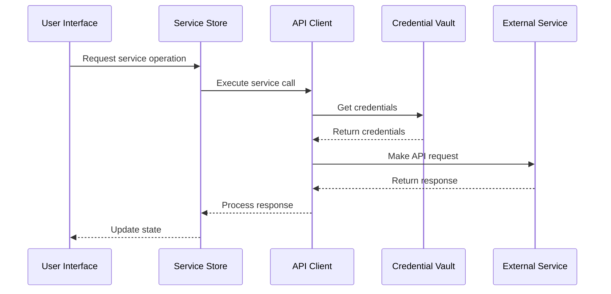

# Service Orchestration Architecture

## Agent Context
**For AI Agents**: Complete service orchestration system covering current implementation and evolution to future orchestration hub architecture. Use this when implementing service orchestration, understanding service coordination patterns, planning orchestration systems, or building complex service workflows. Critical foundation for all service orchestration work.

**Implementation Notes**: Contains service orchestration patterns, workflow management, service coordination systems, and evolution to distributed orchestration hub. Includes working orchestration patterns and service coordination mechanisms.
**Quality Requirements**: Keep orchestration patterns and service coordination methods synchronized with actual implementation. Maintain accuracy of orchestration workflows and service management systems.
**Integration Points**: Foundation for service orchestration, links to service architecture, workflow management, and future distributed orchestration systems for comprehensive service coordination.

---

> **Agent Context**: Complete service orchestration from current connector system to future orchestration hub  
> **Implementation**: 🔄 Active evolution - current system + orchestration enhancements  
> **Decision Impact**: Major - defines all service coordination and task routing

## Executive Summary

This document defines the complete service orchestration architecture spanning the current Kai-CD service connector system through the future kOS Service Orchestration Hub (SOH). It establishes the patterns for service coordination, task routing, credential management, and the evolution pathway for distributed service orchestration.

## Current Orchestration Implementation

### Service Store Architecture

```typescript
// src/store/serviceStore.ts
interface ServiceStore {
  // Service management
  services: ServiceDefinition[];
  activeService: string | null;
  serviceStatuses: Map<string, ServiceStatus>;
  
  // Core operations
  addService: (service: ServiceDefinition) => Promise<void>;
  updateService: (id: string, updates: Partial<ServiceDefinition>) => Promise<void>;
  removeService: (id: string) => Promise<void>;
  
  // Runtime operations
  checkServiceHealth: (id: string) => Promise<ServiceStatus>;
  executeServiceCall: (request: ServiceRequest) => Promise<ServiceResponse>;
}
```

### Universal API Client

```typescript
// src/utils/apiClient.ts
class ApiClient {
  async makeRequest<T>(
    service: ServiceDefinition,
    endpoint: ServiceEndpoint,
    data?: any,
    options?: RequestOptions
  ): Promise<T> {
    // Current orchestration logic
    const config = await this.buildRequestConfig(service, endpoint, data);
    const response = await this.executeRequest(config);
    return this.processResponse<T>(response, endpoint);
  }
  
  private async buildRequestConfig(
    service: ServiceDefinition,
    endpoint: ServiceEndpoint,
    data?: any
  ): Promise<RequestConfig> {
    // Credential injection
    const credentials = await this.getCredentials(service.id);
    
    // URL construction
    const url = this.buildUrl(service.baseUrl, endpoint.path, data);
    
    // Header construction
    const headers = this.buildHeaders(service.auth, credentials, endpoint);
    
    return { url, headers, method: endpoint.method, body: data };
  }
}
```

### Service Definition System

```typescript
// src/connectors/definitions/
interface ServiceDefinition {
  id: string;
  name: string;
  description: string;
  baseUrl: string;
  auth: AuthConfig;
  capabilities: ServiceCapability[];
  endpoints: ServiceEndpoint[];
  healthCheck?: HealthCheckConfig;
  ui?: UIConfig;
}

interface ServiceEndpoint {
  id: string;
  path: string;
  method: 'GET' | 'POST' | 'PUT' | 'DELETE';
  description: string;
  parameters?: ParameterDefinition[];
  response?: ResponseSchema;
}
```

## Current Orchestration Patterns

### Capability-Based Routing

```typescript
// Service selection by capability
const findServicesByCapability = (capability: string): ServiceDefinition[] => {
  return services.filter(service => 
    service.capabilities.some(cap => cap.type === capability)
  );
};

// Dynamic UI rendering based on capabilities
const CapabilityUI: React.FC<{ serviceId: string }> = ({ serviceId }) => {
  const service = useServiceStore(state => 
    state.services.find(s => s.id === serviceId)
  );
  
  return (
    <>
      {service?.capabilities.map(capability => (
        <CapabilityRenderer key={capability.type} capability={capability} />
      ))}
    </>
  );
};
```

### Request/Response Flow



## Evolution to Orchestration Hub

### Future Architecture Vision

```typescript
// Future: Service Orchestration Hub (SOH)
interface ServiceOrchestrationHub {
  // Core orchestration
  orchestrator: Orchestrator;
  serviceRegistry: ServiceRegistry;
  credentialInjector: CredentialInjector;
  policyEngine: PolicyEngine;
  
  // Advanced features
  delegationManager: DelegationManager;
  retryHandler: RetryHandler;
  middleware: MiddlewareStack;
  
  // Monitoring & observability
  metricsCollector: MetricsCollector;
  auditLogger: AuditLogger;
  healthMonitor: HealthMonitor;
}
```

### Enhanced Service Registry

```typescript
// Future: Enhanced service discovery and management
interface EnhancedServiceRegistry {
  // Service lifecycle
  registerService(definition: ServiceDefinition): Promise<void>;
  deregisterService(id: string): Promise<void>;
  updateServiceMetadata(id: string, metadata: ServiceMetadata): Promise<void>;
  
  // Service discovery
  findServicesByCapability(capability: string, filters?: ServiceFilter[]): Promise<ServiceDefinition[]>;
  findServicesByTag(tags: string[]): Promise<ServiceDefinition[]>;
  findNearestService(capability: string, location?: Location): Promise<ServiceDefinition>;
  
  // Health monitoring
  monitorServiceHealth(id: string): Promise<HealthStatus>;
  getServiceMetrics(id: string, timeRange: TimeRange): Promise<ServiceMetrics>;
}
```

## Advanced Orchestration Features

### Policy Engine

```typescript
// Future: Policy-based service orchestration
interface PolicyEngine {
  // Policy evaluation
  evaluateServiceAccess(request: ServiceRequest, context: RequestContext): Promise<PolicyDecision>;
  enforceRateLimits(serviceId: string, userId: string): Promise<boolean>;
  checkResourceConstraints(request: ServiceRequest): Promise<ResourceCheck>;
  
  // Policy configuration
  policies: ServicePolicy[];
  ruleEngine: RuleEngine;
  contextProvider: ContextProvider;
}

interface ServicePolicy {
  id: string;
  name: string;
  conditions: PolicyCondition[];
  actions: PolicyAction[];
  priority: number;
  enabled: boolean;
}
```

### Delegation Manager

```typescript
// Future: Multi-agent task delegation
interface DelegationManager {
  // Task splitting and delegation
  delegateTask(task: OrchestrationTask, agents: AgentDefinition[]): Promise<DelegationResult>;
  mergeResults(results: TaskResult[]): Promise<MergedResult>;
  
  // Agent coordination
  coordinateAgents(coordination: AgentCoordination): Promise<CoordinationResult>;
  balanceLoad(tasks: OrchestrationTask[], agents: AgentDefinition[]): Promise<TaskAssignment[]>;
}

interface OrchestrationTask {
  id: string;
  type: TaskType;
  priority: TaskPriority;
  requirements: TaskRequirements;
  payload: any;
  deadline?: Date;
}
```

### Retry & Resilience

```typescript
// Enhanced retry and resilience patterns
interface RetryHandler {
  // Retry strategies
  executeWithRetry<T>(
    operation: () => Promise<T>,
    strategy: RetryStrategy
  ): Promise<T>;
  
  // Circuit breaker pattern
  circuitBreaker: CircuitBreaker;
  
  // Fallback mechanisms
  fallbackChain: FallbackChain;
}

interface RetryStrategy {
  maxAttempts: number;
  delayStrategy: 'fixed' | 'exponential' | 'linear';
  baseDelay: number;
  maxDelay: number;
  jitter: boolean;
  retryCondition: (error: Error) => boolean;
}
```

## Middleware Architecture

### Current: Basic Middleware

```typescript
// Current: Simple request/response processing
interface RequestProcessor {
  preProcess(request: ServiceRequest): Promise<ServiceRequest>;
  postProcess(response: ServiceResponse): Promise<ServiceResponse>;
  handleError(error: Error, request: ServiceRequest): Promise<ServiceResponse>;
}
```

### Future: Comprehensive Middleware Stack

```typescript
// Future: Pluggable middleware system
interface MiddlewareStack {
  middleware: Middleware[];
  
  addMiddleware(middleware: Middleware): void;
  removeMiddleware(id: string): void;
  executeMiddleware(context: MiddlewareContext): Promise<MiddlewareResult>;
}

interface Middleware {
  id: string;
  priority: number;
  onRequest?(context: RequestContext): Promise<RequestContext>;
  onResponse?(context: ResponseContext): Promise<ResponseContext>;
  onError?(context: ErrorContext): Promise<ErrorContext>;
}

// Built-in middleware types
class AuthenticationMiddleware implements Middleware {
  // Handles credential injection and validation
}

class MetricsMiddleware implements Middleware {
  // Collects timing and performance metrics
}

class CachingMiddleware implements Middleware {
  // Implements intelligent response caching
}

class SanitizationMiddleware implements Middleware {
  // Validates and sanitizes inputs/outputs
}
```

## Configuration System

### Current Configuration

```typescript
// src/config/env.ts - Current configuration system
export const config = {
  // Service defaults
  services: {
    defaultTimeout: 30000,
    maxRetries: 3,
    healthCheckInterval: 60000
  },
  
  // API client settings
  api: {
    userAgent: 'Kai-CD/1.0',
    maxConcurrentRequests: 10
  }
};
```

### Future: Advanced Configuration

```yaml
# Future: orchestration.yaml
orchestration:
  retry:
    max_attempts: 3
    delay_strategy: exponential
    base_delay_ms: 200
    jitter: true
    
  policies:
    fallback_on_error: true
    allow_cross_agent: true
    max_parallel_tasks: 5
    
  credential_injection:
    allow_external_vault: false
    auto_load_from_prompt_vault: true
    
  middleware:
    - id: authentication
      enabled: true
      priority: 100
    - id: metrics
      enabled: true
      priority: 50
    - id: caching
      enabled: false
      priority: 25
      
  telemetry:
    log_to_file: true
    log_file_path: logs/orchestration.log
    emit_events: true
    metrics_endpoint: http://localhost:9090/metrics
```

## Monitoring & Observability

### Current: Basic Logging

```typescript
// Current: Simple logging in apiClient
private logRequest(request: RequestConfig): void {
  logger.info('Service request', {
    service: request.serviceId,
    endpoint: request.endpoint,
    timestamp: new Date().toISOString()
  });
}
```

### Future: Comprehensive Observability

```typescript
// Future: Full observability stack
interface ObservabilityStack {
  metricsCollector: MetricsCollector;
  traceCollector: TraceCollector;
  logAggregator: LogAggregator;
  alertManager: AlertManager;
}

interface ServiceMetrics {
  requestCount: number;
  responseTime: PercentileMetrics;
  errorRate: number;
  throughput: number;
  availability: number;
  
  // Advanced metrics
  resourceUtilization: ResourceMetrics;
  costMetrics: CostMetrics;
  userSatisfactionScore: number;
}

interface TraceData {
  traceId: string;
  spanId: string;
  parentSpanId?: string;
  operationName: string;
  startTime: Date;
  duration: number;
  tags: Record<string, any>;
  logs: LogEntry[];
}
```

## Service Health Management

### Current Health Checks

```typescript
// Current: Basic health checking
const checkServiceHealth = async (service: ServiceDefinition): Promise<ServiceStatus> => {
  try {
    const response = await fetch(`${service.baseUrl}/health`);
    return {
      status: response.ok ? 'healthy' : 'unhealthy',
      lastChecked: new Date(),
      responseTime: response.headers.get('x-response-time')
    };
  } catch (error) {
    return {
      status: 'error',
      lastChecked: new Date(),
      error: error.message
    };
  }
};
```

### Future: Advanced Health Management

```typescript
// Future: Comprehensive health monitoring
interface HealthMonitor {
  // Health checking strategies
  performHealthCheck(service: ServiceDefinition): Promise<HealthResult>;
  scheduleHealthChecks(services: ServiceDefinition[]): void;
  
  // Health status management
  updateHealthStatus(serviceId: string, status: HealthStatus): void;
  getHealthHistory(serviceId: string, timeRange: TimeRange): Promise<HealthHistory>;
  
  // Alerting and recovery
  triggerHealthAlert(serviceId: string, issue: HealthIssue): void;
  attemptServiceRecovery(serviceId: string): Promise<RecoveryResult>;
}

interface HealthResult {
  serviceId: string;
  status: 'healthy' | 'degraded' | 'unhealthy' | 'unknown';
  responseTime: number;
  timestamp: Date;
  details: HealthDetails;
  recommendations?: string[];
}
```

## Migration Strategy

### Phase 1: Enhanced Current System
- **Improve error handling** with structured error types
- **Add basic retry logic** to API client
- **Implement service health monitoring** dashboard
- **Enhance credential management** with rotation

### Phase 2: Orchestration Foundation
- **Implement policy engine** for service access control
- **Add middleware system** for extensible request processing
- **Create delegation patterns** for multi-service operations
- **Build metrics collection** infrastructure

### Phase 3: Full Orchestration Hub
- **Deploy distributed orchestration** across agents
- **Implement advanced routing** with load balancing
- **Add comprehensive monitoring** and alerting
- **Create service mesh** capabilities

## Implementation Guidelines

### For Current Development
1. **Maintain service definition compatibility** with existing connectors
2. **Enhance error handling** with proper error types and recovery
3. **Add monitoring hooks** to existing API client
4. **Implement graceful degradation** for service failures

### For Future Development
1. **Design policy-driven** orchestration from the start
2. **Implement middleware patterns** for extensibility
3. **Plan for distributed deployment** and agent coordination
4. **Build observability** into every component

## For AI Agents

### Current Orchestration Context
- **Service store** manages all service definitions and state
- **API client** provides universal service communication
- **Capability system** enables dynamic UI and functionality
- **Health monitoring** tracks service availability

### Orchestration Best Practices
- **Use capability-based routing** to find appropriate services
- **Implement proper error handling** with fallback strategies
- **Monitor service health** before making requests
- **Cache responses** when appropriate to reduce load
- **Log all service interactions** for debugging and monitoring

---

