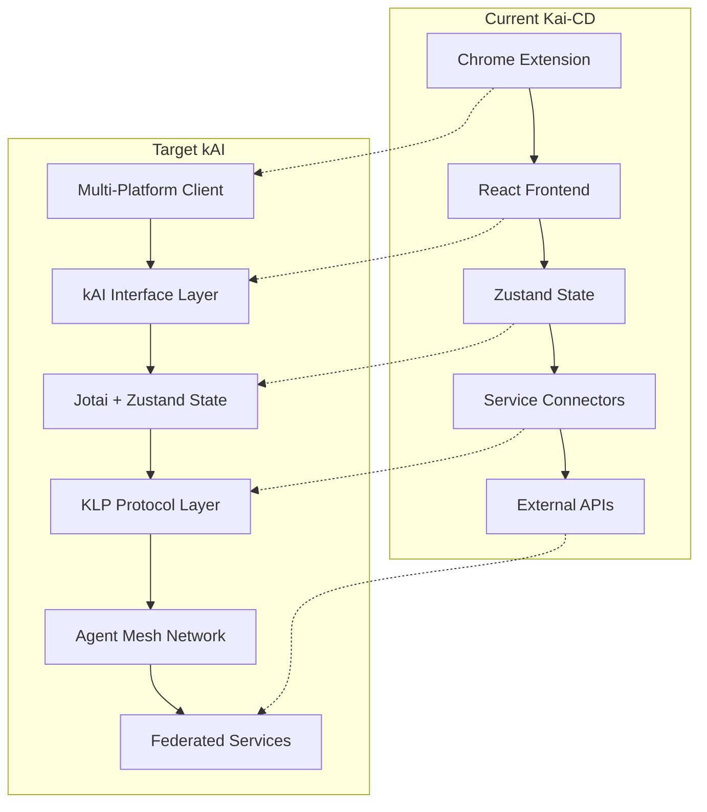

# kOS Integration Analysis & Roadmap for Kai-CD → kAI Transition

## Executive Summary

The kOS (Kind Operating System) represents a comprehensive, decentralized AI operating stack designed for multi-agent collaboration, while Kai-CD is positioned to become kAI (Kind Artificial Intelligence) - the user-facing client layer. This analysis provides a detailed roadmap for integrating Kai-CD's current capabilities into the broader kOS ecosystem.

## Current State Analysis

### Kai-CD Architecture Alignment with kOS

**✅ Strong Alignment Areas:**
- **Service Architecture**: Both use modular, connector-based service integration
- **State Management**: Zustand aligns with kOS recommendations (though kOS prefers Jotai + Zustand hybrid)
- **Security Focus**: Both emphasize vault management, credential security, and encrypted storage
- **Multi-Modal Support**: Shared vision for text, image, audio, and file handling
- **Extension Architecture**: Both support dynamic capability expansion

**⚠️ Areas Requiring Evolution:**
- **Protocol Stack**: Kai-CD uses proprietary service connectors vs. kOS's KLP (Kind Link Protocol)
- **Identity System**: Kai-CD uses basic authentication vs. kOS's DID-based decentralized identity
- **Agent Framework**: Kai-CD is single-agent focused vs. kOS's multi-agent orchestration
- **Network Topology**: Kai-CD is client-server vs. kOS's mesh/P2P architecture

## Protocol Integration Strategy

### Current Industry Protocol Landscape

Based on recent research (2024-2025), the AI agent protocol ecosystem includes:

**Context-Oriented Protocols:**
- **MCP (Model Context Protocol)** - Anthropic's tool integration standard
- **agents.json** - Wildcard AI's web API discovery format

**Inter-Agent Protocols:**
- **A2A (Agent2Agent)** - Google's enterprise agent collaboration protocol
- **ANP (Agent Network Protocol)** - Open-source decentralized agent network
- **ACP (Agent Communication Protocol)** - IBM's framework-agnostic messaging
- **KLP (Kind Link Protocol)** - kOS's native protocol (most advanced)

### Recommended Protocol Adoption Strategy

**Phase 1: Foundation (Immediate)**
- **Primary**: Implement KLP (Kind Link Protocol) as core communication layer
- **Secondary**: Add MCP compatibility for tool integration
- **Rationale**: KLP provides the most comprehensive feature set with DID-based identity, multi-modal messaging, and mesh networking

**Phase 2: Enterprise Integration (3-6 months)**
- **Add**: A2A protocol support for enterprise environments
- **Add**: ANP compatibility for open network participation
- **Rationale**: Enables both closed enterprise and open internet agent collaboration

**Phase 3: Universal Compatibility (6-12 months)**
- **Add**: Protocol translation layers for MCP ↔ KLP ↔ A2A ↔ ANP
- **Add**: Dynamic protocol negotiation (Agora-style meta-protocol)
- **Rationale**: Ensures interoperability across the entire agent ecosystem

## Technical Roadmap

### Architecture Evolution Plan



### State Management Migration

**Current**: Zustand-only
**Target**: Jotai + Zustand hybrid (kOS recommendation)

**Migration Strategy**:
1. **Atomic State**: Convert UI-specific state to Jotai atoms
2. **Global State**: Keep service management and persistence in Zustand
3. **Agent State**: Use Jotai for individual agent state isolation
4. **Shared State**: Use Zustand for cross-agent coordination

### Service Integration Evolution

**Current Services** (18 total):
- **AI Models**: Ollama, OpenAI, Anthropic, HuggingFace, Llama-cpp, LLM-Studio, VLLM, OpenAI-Compatible
- **Image Generation**: A1111, ComfyUI, CivitAI
- **Vector Databases**: Chroma, Milvus, Qdrant  
- **Workflow**: N8N
- **Storage**: Dropbox
- **Networking**: Reticulum, Open-WebUI

**kOS Integration Path**:
1. **Wrap existing connectors** in KLP protocol adapters
2. **Add DID-based authentication** to all service connections
3. **Implement capability discovery** for each service type
4. **Enable federated service sharing** across kOS nodes

## Implementation Phases

### Phase 1: Core Protocol Integration (Month 1-2)

**Deliverables:**
- [ ] KLP protocol implementation
- [ ] DID-based identity system
- [ ] Basic agent-to-agent messaging
- [ ] Service capability discovery

**Technical Tasks:**
```typescript
// New KLP Integration Layer
src/klp/
├── identity/
│   ├── DIDManager.ts          // Decentralized identity management
│   └── IdentityStore.ts       // Secure key storage
├── messaging/
│   ├── KLPClient.ts           // Protocol client implementation
│   ├── MessageRouter.ts       // Multi-hop routing
│   └── ProtocolNegotiator.ts  // Dynamic protocol selection
├── services/
│   ├── ServiceRegistry.ts     // Capability discovery
│   └── ServiceAdapter.ts      // Legacy connector wrapper
└── federation/
    ├── NodeDiscovery.ts       // Mesh network participation
    └── TrustManager.ts        // Agent trust relationships
```

### Phase 2: Multi-Agent Architecture (Month 3-4)

**Deliverables:**
- [ ] Agent orchestration system
- [ ] Task delegation framework
- [ ] Shared memory synchronization
- [ ] Governance participation

**Agent Types to Implement:**
- **Companion Agent**: User's primary assistant (current Kai-CD behavior)
- **Specialist Agents**: Domain experts (finance, health, privacy, etc.)
- **System Agents**: Background services (memory, logging, sync)
- **Interface Agents**: Platform-specific frontends
- **Federated Agents**: External node connections

### Phase 3: Enterprise Integration (Month 5-6)

**Deliverables:**
- [ ] A2A protocol compatibility
- [ ] Enterprise authentication (OAuth, SAML)
- [ ] Audit logging and compliance
- [ ] Role-based access control

### Phase 4: Open Network Participation (Month 7-8)

**Deliverables:**
- [ ] ANP protocol support
- [ ] Public agent marketplace integration
- [ ] Reputation and trust systems
- [ ] Cross-platform interoperability

## Service Documentation Requirements

### Immediate Documentation Needs

**Priority 1: Core AI Services**
- [ ] **Ollama** - Local LLM orchestration
- [ ] **OpenAI** - Cloud LLM integration  
- [ ] **Anthropic** - Claude model access
- [ ] **A1111** - Image generation (in progress)
- [ ] **ComfyUI** - Advanced image workflows

**Priority 2: Infrastructure Services**
- [ ] **Chroma** - Vector database integration
- [ ] **Reticulum** - Mesh networking
- [ ] **N8N** - Workflow automation
- [ ] **Dropbox** - Cloud storage

**Priority 3: Specialized Services**
- [ ] **HuggingFace** - Model hub integration
- [ ] **CivitAI** - Community models
- [ ] **Milvus/Qdrant** - Enterprise vector stores
- [ ] **VLLM/LLM-Studio** - High-performance inference

### Documentation Template Structure

Each service documentation should include:

```markdown
# Service Name Integration Guide

## kOS Integration Status
- **Protocol Support**: KLP, MCP, A2A, ANP compatibility
- **Authentication**: DID-based + legacy support
- **Capability Discovery**: Published capabilities
- **Federation**: Cross-node sharing support

## Service Architecture
- **Connection Pattern**: Direct, Proxy, Federated
- **Message Types**: Supported KLP message formats
- **State Management**: Local vs. shared state
- **Error Handling**: Failure modes and recovery

## Implementation Phases
- **Phase 1**: Basic KLP wrapper
- **Phase 2**: Advanced features
- **Phase 3**: Federation support

## Code Examples
- KLP service adapter implementation
- Capability discovery registration
- Multi-agent delegation patterns
```

## Challenges and Mitigation Strategies

### Technical Challenges

**1. Protocol Complexity**
- **Challenge**: KLP is more complex than current simple HTTP APIs
- **Mitigation**: Gradual migration with compatibility layers

**2. State Management Transition**
- **Challenge**: Moving from Zustand-only to Jotai+Zustand hybrid
- **Mitigation**: Incremental atom-by-atom migration

**3. Multi-Agent Coordination**
- **Challenge**: Current single-agent architecture
- **Mitigation**: Start with simple delegation patterns, evolve to full orchestration

### Ecosystem Challenges

**1. Protocol Fragmentation**
- **Challenge**: Multiple competing protocols (MCP, A2A, ANP, KLP)
- **Mitigation**: Implement translation layers and protocol negotiation

**2. Identity Management**
- **Challenge**: DID adoption vs. existing auth systems
- **Mitigation**: Hybrid approach supporting both DID and legacy auth

**3. Performance Overhead**
- **Challenge**: Protocol layers may add latency
- **Mitigation**: Optimize hot paths, use direct connections when possible

## Success Metrics

### Technical Metrics
- **Protocol Compatibility**: Support for 4+ agent protocols
- **Service Integration**: 100% of current services KLP-enabled
- **Performance**: <10ms protocol overhead per message
- **Reliability**: 99.9% message delivery success rate

### Ecosystem Metrics
- **Interoperability**: Successful agent collaboration across 3+ platforms
- **Federation**: Active participation in 5+ kOS nodes
- **Adoption**: 10+ external agents using our services
- **Innovation**: 3+ new agent types developed

## Conclusion

The transition from Kai-CD to kAI within the kOS ecosystem represents a significant evolution from a single-agent tool to a multi-agent, federated intelligence platform. By adopting KLP as the primary protocol while maintaining compatibility with emerging standards (MCP, A2A, ANP), we can ensure both immediate functionality and long-term ecosystem participation.

The phased approach allows for gradual migration while maintaining current functionality, ultimately positioning kAI as a leading participant in the emerging "Internet of Agents" - a decentralized, interoperable network of AI agents working together to solve complex problems.

**Next Steps:**
1. Begin KLP protocol implementation
2. Create service documentation for priority 1 services
3. Establish development timeline and milestones
4. Begin community engagement with kOS ecosystem

---

*Document Version: 1.0*  
*Last Updated: 2025-01-20*  
