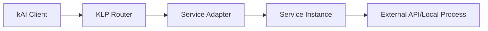

# Service Documentation Roadmap for kOS Integration

## Overview

This document outlines the documentation requirements for all 18 services in Kai-CD as we transition to kAI and integrate with the kOS ecosystem. Each service needs comprehensive documentation covering current functionality, kOS integration path, and protocol compatibility.

## Service Inventory & Priority Matrix

### Priority 1: Core AI Services (Immediate - Week 1-2)
Essential services that form the foundation of AI agent capabilities.

| Service | Type | Current Status | kOS Integration Complexity | Documentation Status |
|---------|------|----------------|---------------------------|---------------------|
| **Ollama** | LLM Orchestration | ✅ Working (9 models) | Medium - Local mesh networking | 📝 Needs docs |
| **OpenAI** | Cloud LLM | ✅ Working | Low - API wrapper | 📝 Needs docs |
| **Anthropic** | Cloud LLM | ✅ Working | Low - API wrapper | 📝 Needs docs |
| **A1111** | Image Generation | 🔄 75% complete | High - Complex workflows | 📄 In progress |
| **ComfyUI** | Advanced Image | ✅ Working | High - Node-based workflows | 📝 Needs docs |

### Priority 2: Infrastructure Services (Week 3-4)
Core infrastructure that enables advanced agent capabilities.

| Service | Type | Current Status | kOS Integration Complexity | Documentation Status |
|---------|------|----------------|---------------------------|---------------------|
| **Chroma** | Vector Database | ✅ Working | Medium - Federated search | 📝 Needs docs |
| **Reticulum** | Mesh Networking | ✅ Working | High - Core kOS transport | 📝 Needs docs |
| **N8N** | Workflow Automation | ✅ Working | Medium - Agent orchestration | 📝 Needs docs |
| **Dropbox** | Cloud Storage | ✅ Working | Low - Storage federation | 📄 Exists |
| **Open-WebUI** | Web Interface | ✅ Working | Medium - Multi-agent UI | 📝 Needs docs |

### Priority 3: Specialized Services (Week 5-6)
Advanced and specialized services for specific use cases.

| Service | Type | Current Status | kOS Integration Complexity | Documentation Status |
|---------|------|----------------|---------------------------|---------------------|
| **HuggingFace** | Model Hub | ✅ Working | Medium - Model federation | 📝 Needs docs |
| **CivitAI** | Community Models | ✅ Working | Medium - Model sharing | 📝 Needs docs |
| **Milvus** | Enterprise Vector DB | ✅ Working | High - Enterprise features | 📝 Needs docs |
| **Qdrant** | Vector Database | ✅ Working | Medium - Performance focus | 📝 Needs docs |
| **VLLM** | High-Performance LLM | ✅ Working | Medium - Inference optimization | 📝 Needs docs |
| **LLM-Studio** | Local LLM | ✅ Working | Medium - Local deployment | 📝 Needs docs |
| **Llama-cpp** | Optimized LLM | ✅ Working | Medium - Hardware optimization | 📝 Needs docs |
| **OpenAI-Compatible** | Generic API | ✅ Working | Low - Standard interface | 📝 Needs docs |

## Documentation Template Structure

Each service documentation should follow this comprehensive structure:

```markdown
# [Service Name] - kOS Integration Guide

## Service Overview
- **Purpose**: What this service does
- **Category**: AI Model / Vector DB / Storage / Workflow / etc.
- **Provider**: Company/Organization
- **License**: Open source / Commercial / etc.

## Current Implementation Status
- **Integration Level**: Basic / Advanced / Expert
- **Completion**: X% complete
- **Key Features**: List of implemented features
- **Known Limitations**: Current gaps or issues

## kOS Integration Analysis

### Protocol Compatibility
- **KLP Support**: Native / Adapter / Planned
- **MCP Compatibility**: Yes / No / Planned
- **A2A Integration**: Supported / Planned
- **ANP Federation**: Supported / Planned

### Identity & Authentication
- **Current Auth**: API keys / OAuth / etc.
- **DID Integration**: Planned implementation
- **Trust Model**: How service fits in kOS trust network

### Capability Discovery
```json
{
  "serviceId": "service-name",
  "version": "1.0.0",
  "capabilities": ["capability1", "capability2"],
  "roles": ["role1", "role2"],
  "protocols": ["klp/1.0", "mcp/1.0"],
  "endpoints": {
    "primary": "klp://service.example.com",
    "fallback": "https://api.example.com"
  }
}
```

### Federation Model
- **Sharing Pattern**: Private / Federated / Public
- **Resource Requirements**: CPU / GPU / Memory / Storage
- **Scaling Characteristics**: How it scales in mesh network

## Technical Architecture

### Connection Patterns
- **Direct**: Service runs locally
- **Proxy**: Service behind gateway
- **Federated**: Service shared across nodes
- **Hybrid**: Multiple connection modes

### Message Flow


### State Management
- **Local State**: What's kept locally
- **Shared State**: What's federated
- **Persistence**: How data is stored
- **Synchronization**: How state syncs across nodes

## Implementation Phases

### Phase 1: KLP Wrapper (Week X)
- [ ] Basic KLP message handling
- [ ] Service capability registration
- [ ] Error handling and recovery
- [ ] Basic authentication

### Phase 2: Advanced Features (Week X+1)
- [ ] DID-based authentication
- [ ] Capability negotiation
- [ ] Performance optimization
- [ ] Monitoring and metrics

### Phase 3: Federation Support (Week X+2)
- [ ] Cross-node service sharing
- [ ] Trust and reputation integration
- [ ] Load balancing and failover
- [ ] Governance participation

## Code Examples

### KLP Service Adapter
```typescript
import { KLPService, ServiceCapability } from '@kai/klp';

export class [ServiceName]KLPAdapter extends KLPService {
  async initialize() {
    // Service initialization
  }
  
  async handleRequest(message: KLPMessage) {
    // Request handling
  }
  
  getCapabilities(): ServiceCapability[] {
    // Return service capabilities
  }
}
```

### Multi-Agent Delegation
```typescript
// Example of how other agents can use this service
const result = await agentManager.delegateTask({
  serviceType: 'service-name',
  capability: 'specific-capability',
  parameters: { /* task parameters */ }
});
```

## Testing & Validation

### Integration Tests
- [ ] KLP message handling
- [ ] Service capability discovery
- [ ] Multi-agent coordination
- [ ] Error scenarios

### Performance Benchmarks
- **Latency**: Target < Xms for typical requests
- **Throughput**: Target X requests/second
- **Resource Usage**: CPU/Memory/Network limits

### Security Validation
- [ ] DID authentication working
- [ ] Message encryption/signing
- [ ] Access control enforcement
- [ ] Audit logging

## Migration Path

### From Current Implementation
1. **Wrapper Phase**: Add KLP adapter around existing connector
2. **Enhancement Phase**: Add kOS-specific features
3. **Federation Phase**: Enable cross-node sharing
4. **Optimization Phase**: Performance and reliability improvements

### Backward Compatibility
- Existing configurations should continue working
- Gradual migration of authentication methods
- Fallback to direct API calls if KLP unavailable

## Troubleshooting

### Common Issues
- **Connection Problems**: How to diagnose and fix
- **Authentication Failures**: DID vs. legacy auth issues
- **Performance Issues**: Optimization strategies
- **Federation Problems**: Cross-node communication issues

### Debugging Tools
- KLP message inspector
- Service capability validator
- Performance profiler
- Network topology viewer

## Future Roadmap

### Short Term (1-3 months)
- Enhanced error handling
- Performance optimizations
- Additional capability discovery

### Medium Term (3-6 months)
- Advanced federation features
- Cross-service orchestration
- Enhanced security features

### Long Term (6+ months)
- AI-driven service optimization
- Autonomous service management
- Advanced governance participation

---

*Last Updated: [Date]*
*Next Review: [Date + 1 month]*
```

## Implementation Timeline

### Week 1-2: Priority 1 Services
- **Ollama**: Local LLM orchestration with mesh networking
- **OpenAI**: Cloud API with KLP wrapper
- **Anthropic**: Claude integration with DID auth
- **A1111**: Complete image generation documentation
- **ComfyUI**: Advanced workflow documentation

### Week 3-4: Priority 2 Services  
- **Chroma**: Vector database federation
- **Reticulum**: Core mesh networking integration
- **N8N**: Workflow automation with agent orchestration
- **Open-WebUI**: Multi-agent interface documentation
- **Dropbox**: Enhanced storage federation

### Week 5-6: Priority 3 Services
- **HuggingFace**: Model hub federation
- **CivitAI**: Community model sharing
- **Milvus/Qdrant**: Enterprise vector databases
- **VLLM/LLM-Studio/Llama-cpp**: Performance-optimized LLMs
- **OpenAI-Compatible**: Generic API wrapper

## Success Criteria

### Documentation Quality
- [ ] All 18 services have complete documentation
- [ ] Each service has working KLP integration examples
- [ ] Clear migration paths from current to kOS integration
- [ ] Comprehensive troubleshooting guides

### Technical Implementation
- [ ] 100% of services have KLP adapters
- [ ] 80% of services support DID-based authentication
- [ ] 60% of services support cross-node federation
- [ ] All services participate in capability discovery

### Ecosystem Integration
- [ ] Services discoverable by other kOS nodes
- [ ] Multi-agent delegation patterns working
- [ ] Performance meets kOS network requirements
- [ ] Security and trust integration complete

## Resource Requirements

### Documentation Team
- **Technical Writers**: 2-3 people for 6 weeks
- **kOS Integration Experts**: 1-2 people for consultation
- **Service Domain Experts**: 1 person per service for review

### Development Support
- **KLP Implementation**: Core protocol team support
- **Testing Infrastructure**: Automated testing setup
- **Review Process**: Technical review and validation

---

