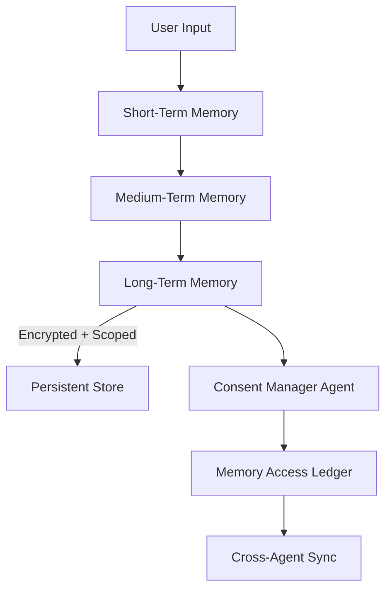

# User-Agent Memory Architecture

> **Agent Context**: Complete user-agent memory system for kOS distributed architecture  
> **Implementation**: 🎯 Future design - critical for agent identity and context persistence  
> **Use When**: Planning memory systems, implementing agent persistence, designing identity management

## Quick Summary
Comprehensive architecture for managing memory, identity, and context between users and agents across kAI and kOS systems, featuring multi-tier memory, namespace management, and cross-agent context synchronization.

## Implementation Status
- 🔬 **Research**: Multi-tier memory architecture design
- 🔬 **Research**: Identity graph and namespace management
- 🔬 **Research**: Cross-agent context synchronization
- 📋 **Planned**: Vector database integration
- 📋 **Planned**: Distributed memory federation

## Overview

This document defines the architecture, standards, and mechanisms used to manage memory, identity, and context between users and agents across the kAI (kindAI) and kOS (kindOS) systems.

### Core Objectives
- Long-term identity and context persistence
- Adaptive memory based on user preferences and security class
- Namespace management across services and devices
- Cross-agent context synchronization with user consent

## Memory Type Architecture

### Memory Tier Specifications

#### 1. Short-Term Memory (STM)
**Lifecycle**: Session-scoped, volatile
**Storage**: RAM/browser memory
**Expiry**: Tab/process close or session timeout
**Encryption**: In-memory only (no persistence)

```typescript
interface ShortTermMemory {
  sessionId: string;
  agentId: string;
  conversationContext: ConversationState[];
  taskExecution: TaskState[];
  uiState: InterfaceState;
  expiryTimestamp: number;
}
```

**Use Cases**:
- In-progress conversations and dialogue context
- Volatile task execution state
- Local UI state transitions
- Temporary scratchpad data

#### 2. Medium-Term Memory (MTM)
**Lifecycle**: Day-scoped, semi-persistent
**Storage**: IndexedDB with AES-256 encryption
**Expiry**: 24 hours or session end
**Sync**: Local device only

```typescript
interface MediumTermMemory {
  id: string;
  userId: string;
  agentId: string;
  namespace: string;
  content: EncryptedMemoryBlock;
  tags: string[];
  priority: 'low' | 'medium' | 'high';
  ttl: number;
  created: Date;
  lastAccessed: Date;
}
```

**Use Cases**:
- Form autofill and user preference caching
- Daily task planning and scheduling
- Context switching between application views
- Temporary project or workflow state

#### 3. Long-Term Memory (LTM)
**Lifecycle**: Persistent, cross-session
**Storage**: SQLite + encrypted volume with AES-256-GCM + PBKDF2
**Expiry**: Never (user-controlled purge only)
**Sync**: Cross-device with consent

```typescript
interface LongTermMemory {
  id: string;
  namespace: MemoryNamespace;
  identityGraph: UserIdentityGraph;
  memoryBlocks: PersistentMemoryBlock[];
  relationships: AgentRelationshipMap;
  preferences: UserPreferenceProfile;
  trustScores: TrustScoreMap;
  consentLedger: ConsentRecord[];
}
```

**Use Cases**:
- User relationship models and interaction patterns
- Multi-agent collaboration memory
- Personal preferences and identity profiles
- Long-term learning and adaptation data

## Memory Store Implementation

### Storage Backend Matrix

| Memory Type | Backend | Encryption | Expiry | Access Pattern | Example Use Case |
|-------------|---------|------------|--------|----------------|------------------|
| STM | RAM | N/A | Tab/process close | Direct | Conversational state |
| MTM | IndexedDB | AES-256 | 24h/session end | Indexed | UI state caching |
| LTM | SQLite + Encrypted Volume | AES-256-GCM + PBKDF2 | User-controlled | Query/search | Knowledge retention |

### Implementation Architecture

```typescript
// Memory store interface
interface MemoryStore {
  // Core operations
  store(namespace: string, data: MemoryData, tier: MemoryTier): Promise<string>;
  retrieve(namespace: string, query: MemoryQuery): Promise<MemoryData[]>;
  delete(namespace: string, id: string): Promise<boolean>;
  
  // Advanced operations
  search(query: SemanticQuery): Promise<MemorySearchResult[]>;
  compress(namespace: string): Promise<CompressionResult>;
  sync(targetAgent: AgentIdentity, consentToken: ConsentToken): Promise<SyncResult>;
}
```

## Identity Architecture

### User Identity Graph

Each user maintains a dynamic identity graph with cryptographic verification:

```typescript
interface UserIdentityGraph {
  uuid: string; // Universal identifier
  profiles: IdentityProfile[];
  trustTiers: TrustTierMap;
  serviceCredentials: ServiceCredentialMap;
  consentAuditLog: ConsentAuditRecord[];
  deviceBindings: DeviceBinding[];
}

interface IdentityProfile {
  name?: string;
  pronouns?: string[];
  location?: GeoLocation;
  age?: number;
  preferences: UserPreference[];
  customFields: Record<string, any>;
}
```

### Identity Sharing Framework

#### Sharing Layer Specifications

| Layer | Scope | Consent Required | Transport Protocol | Security Level |
|-------|-------|------------------|-------------------|----------------|
| Private | Device only | No | Local FS | High |
| Session | Application context | Yes (UI prompt) | Socket/WebRTC | Medium |
| Federated | Cross-application | Yes (verified) | KLP/gRPC | High |

#### Consent Management

```typescript
interface ConsentManager {
  requestAccess(
    agentId: string, 
    memoryScope: MemoryScope, 
    purpose: string
  ): Promise<ConsentToken>;
  
  revokeAccess(agentId: string, scope: MemoryScope): Promise<boolean>;
  
  auditAccess(userId: string, timeRange: TimeRange): Promise<AccessAuditLog>;
}
```

## Namespace Management & Boundaries

### Namespace Format Specification

```
user.{uuid}.agent.{agent_id}.memory.{type}.{scope}
```

#### Namespace Examples
- `user.89e3f4a2.agent.chat.memory.ltm.personal`
- `user.12df8b91.agent.scheduler.memory.mtm.project123`
- `user.777a6c5d.agent.profile.memory.ltm.shared`

### Cross-Agent Access Control

```typescript
interface CrossAgentAccess {
  intent: AccessIntent;
  scope: MemoryScope[];
  consentToken: SignedConsentToken;
  auditLogger: AuditLogger;
}

interface AccessIntent {
  purpose: string;
  duration: Duration;
  accessLevel: 'read' | 'write' | 'admin';
  dataTypes: string[];
}
```

**Access Rules**:
- Must declare explicit intent with context type
- Require memory-binding scope tags
- Consent token from user (JWT-style signed grant)
- All access logged via immutable consent ledger (KLP)

## Data Governance & Control

### Consent Manager Agent (kAI-consent)

```typescript
interface ConsentManagerAgent {
  // UI operations
  showConsentRequest(request: ConsentRequest): Promise<ConsentDecision>;
  listActiveConsents(userId: string): Promise<ActiveConsent[]>;
  
  // Memory tagging
  tagMemory(memoryId: string, tags: MemoryTag[]): Promise<boolean>;
  
  // Lifecycle management
  scheduleExpiration(memoryId: string, expiry: Date): Promise<boolean>;
}

enum MemoryTag {
  EPHEMERAL = 'ephemeral',     // Auto-purged
  REVIEWED = 'reviewed',       // User-reviewed
  SEALED = 'sealed'            // Requires biometric/PIN
}
```

### Data Purge & Redaction Tools

```typescript
interface DataManagement {
  // Purge operations
  wipeMemorycategory(category: MemoryCategory): Promise<PurgeResult>;
  deleteByNamespace(namespace: string): Promise<boolean>;
  propagateDelete(deleteEvent: DeleteEvent): Promise<PropagationResult>;
  
  // Export/import
  exportMemory(scope: MemoryScope, format: 'json' | 'protobuf'): Promise<EncryptedExport>;
  importMemory(encryptedData: EncryptedExport, verification: HashVerification): Promise<ImportResult>;
}
```

## Advanced Memory Features

### Context Cloning
**Purpose**: Create isolated memory snapshots for specific agent deployments

```typescript
interface ContextClone {
  createSnapshot(
    sourceAgentId: string, 
    targetAgentId: string, 
    scope: MemoryScope
  ): Promise<CloneResult>;
  
  verifyProvenance(cloneId: string): Promise<ProvenanceChain>;
  
  syncCloneUpdates(cloneId: string, updates: MemoryUpdate[]): Promise<SyncResult>;
}
```

### Dynamic Memory Compression
**Purpose**: Optimize storage through intelligent summarization

```typescript
interface MemoryCompression {
  compressMemories(
    namespace: string, 
    compressionStrategy: 'llm_summary' | 'embedding_only' | 'statistical'
  ): Promise<CompressionResult>;
  
  scheduleCompression(trigger: CompressionTrigger): Promise<ScheduleResult>;
}

interface CompressionTrigger {
  storageThreshold?: number;
  inactivityPeriod?: Duration;
  userRequest?: boolean;
}
```

### Trust-Level Memory Access
**Purpose**: Graduated memory access based on agent trust scores

```typescript
interface TrustBasedAccess {
  getMemoryByTrustLevel(agentId: string, trustLevel: number): Promise<MemoryData[]>;
  
  validateTrustLevel(agentId: string): Promise<TrustValidation>;
  
  escalateAccess(agentId: string, reason: string): Promise<EscalationResult>;
}

// Trust level examples:
// Level 1: Task memory only
// Level 3: Profile, habits, sensitive data
// Level 5: Full system access
```

## Memory Flow Architecture

### Memory Processing Pipeline



### Identity Federation Flow


## API Specification

### Memory Access APIs

#### Memory Read API
```typescript
// GET /memory/read
interface MemoryReadRequest {
  namespace: string;
  agentId: string;
  trustLevel: number;
  query?: MemoryQuery;
  limit?: number;
}

interface MemoryReadResponse {
  memories: MemoryData[];
  accessToken: string;
  expiryTime: Date;
  auditId: string;
}
```

#### Memory Write API
```typescript
// POST /memory/write
interface MemoryWriteRequest {
  data: MemoryData;
  intent: AccessIntent;
  namespace: string;
  ttl?: Duration;
  tags?: MemoryTag[];
}

interface MemoryWriteResponse {
  memoryId: string;
  hash: string;
  timestamp: Date;
  storageNode: string;
  auditId: string;
}
```

#### Consent Management API
```typescript
// POST /memory/consent
interface ConsentRequest {
  agentId: string;
  memoryScope: MemoryScope;
  purpose: string;
  duration: Duration;
}

interface ConsentResponse {
  consentToken: SignedConsentToken;
  expiryTime: Date;
  restrictions: AccessRestriction[];
}
```

## Future Enhancements

### Advanced Features Roadmap
- **Zero-knowledge memory segments**: User-visible only memory with cryptographic privacy
- **Peer-to-peer encrypted memory sync**: Direct device-to-device memory synchronization
- **Quantum-resistant encryption**: Post-quantum cryptographic upgrades
- **Semantic memory search**: Vector-based semantic similarity search
- **Memory analytics**: Usage patterns and optimization recommendations

### Integration Points
- **Vector Database Integration**: Semantic search across memory spaces
- **Blockchain Audit Trail**: Immutable consent and access logging
- **Multi-modal Memory**: Support for text, images, audio, and structured data
- **Federated Learning**: Privacy-preserving model training across memory stores

## For AI Agents

### When to Use This Architecture
- ✅ Implementing persistent agent memory systems
- ✅ Designing user identity and context management
- ✅ Planning cross-agent collaboration features
- ✅ Building consent and privacy management systems

### Key Implementation Points
- Multi-tier memory architecture provides flexibility and performance optimization
- Namespace management ensures proper data isolation and access control
- Consent-driven access model maintains user privacy and control
- Trust-based memory access provides graduated security levels
- Cross-agent synchronization enables collaborative workflows

### Integration with Current System
This architecture extends the current Chrome storage-based memory system toward a comprehensive, distributed, and secure memory framework suitable for the kOS agent mesh ecosystem.

## Related Documentation
- **Current**: [Memory Architecture](../../current/architecture/04_memory-architecture.md)
- **Future**: [Agent Hierarchy](./01_agent-hierarchy.md)
- **Bridge**: [Service Migration Strategy](../../bridge/05_service-migration.md)

## External References
- [KLP Protocol Specification](../protocols/01_klp-specification.md)
- [kOS System Overview](../architecture/01_kos-system-overview.md)
