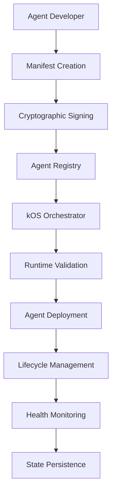

# Agent Manifest & Metadata System

## Agent Context

### Integration Points
- **kOS Agent Orchestration Layer**: Primary consumer of manifest data for agent discovery and validation
- **Agent Registry Services**: Centralized catalog of available agents with manifest metadata
- **Trust & Security Framework**: Cryptographic signing and verification of agent manifests
- **Service Discovery Protocol**: Dynamic agent capability discovery and routing
- **Deployment & Scaling Systems**: Container orchestration and resource allocation based on manifest requirements

### Dependencies
- **kAI Link Protocol (KLP)**: Message format and communication standards
- **Cryptographic Infrastructure**: Ed25519 signing and verification for manifest integrity
- **Container Runtime**: Docker/Podman for agent sandboxing and isolation
- **Service Registry**: Consul/etcd for agent registration and discovery
- **Vault System**: Secure storage and injection of agent secrets

### Data Flow


---

## Overview

The Agent Manifest & Metadata System provides the foundational specification for agent introspection, lifecycle management, and compatibility enforcement within the kAI ecosystem. Every agent must contain a machine-readable manifest that describes its capabilities, dependencies, interfaces, personality, and security requirements.

This manifest enables dynamic discovery, validation, and orchestration by the kOS agent host while acting as the authoritative source of truth for agent configuration, dependencies, and trust metadata.

## Core Architecture

### Manifest Structure

The agent manifest follows a hierarchical YAML/JSON schema that encompasses all aspects of agent definition:

```typescript
interface AgentManifest {
  // Core Identity
  id: string;                    // Globally unique identifier (reverse-DNS format)
  name: string;                  // Human-friendly display name
  version: string;               // SemVer-compliant version string
  description: string;           // Purpose and functionality summary
  author: string;                // Creator or publisher information
  license: string;               // SPDX identifier or license text
  
  // Agent Personality & Behavior
  persona: AgentPersona;
  capabilities: AgentCapability[];
  
  // Technical Configuration
  entry: AgentEntry;
  interfaces: AgentInterface[];
  requirements: AgentRequirements;
  storage: AgentStorage;
  secrets: string[];
  
  // Security & Trust
  trust: TrustMetadata;
  permissions: AgentPermissions;
  
  // Lifecycle Management
  lifecycle: LifecycleHooks;
  conforms_to: string[];
}

interface AgentPersona {
  name: string;                  // Agent's persona name
  role: string;                  // Functional role description
  tone: string;                  // Communication style
  language: string;              // Primary language (ISO 639-1)
  default_prompt: string;        // Base system prompt
  personality_traits?: string[]; // Optional behavioral modifiers
}

interface AgentCapability {
  name: string;                  // Standardized capability identifier
  version?: string;              // Capability version if applicable
  parameters?: Record<string, any>; // Capability-specific configuration
}

interface AgentEntry {
  type: 'llm' | 'service' | 'function' | 'hybrid';
  handler: string;               // Entry point file or command
  runtime?: string;              // Runtime environment specification
  args?: string[];               // Default arguments
}

interface AgentInterface {
  type: 'http' | 'grpc' | 'cli' | 'websocket' | 'message_queue';
  route?: string;                // HTTP route or endpoint
  methods?: string[];            // Supported HTTP methods
  command?: string;              // CLI command format
  port?: number;                 // Network port for services
  protocol_version?: string;     // Interface protocol version
}

interface AgentRequirements {
  runtime: RuntimeRequirements;
  packages: PackageRequirements;
  hardware?: HardwareRequirements;
  network?: NetworkRequirements;
}

interface RuntimeRequirements {
  python?: string;               // Python version constraint
  node?: string;                 // Node.js version constraint
  docker?: string;               // Docker version constraint
  memory_mb?: number;            // Minimum memory requirement
  cpu_cores?: number;            // CPU core requirement
}

interface PackageRequirements {
  pip?: Record<string, string>;  // Python packages with version constraints
  npm?: Record<string, string>;  // Node.js packages with version constraints
  system?: string[];             // System packages (apt, yum, etc.)
}

interface AgentStorage {
  persistent?: StorageMount[];   // Long-term data storage
  volatile?: StorageMount[];     // Temporary/cache storage
  shared?: StorageMount[];       // Inter-agent shared storage
}

interface StorageMount {
  name: string;                  // Mount identifier
  type: 'filesystem' | 'database' | 'redis' | 'vector_db' | 's3';
  path?: string;                 // Local filesystem path
  connection?: StorageConnection; // Database/service connection details
  size_limit?: string;           // Storage size constraint
  backup_policy?: BackupPolicy;  // Backup configuration
}

interface TrustMetadata {
  signed: boolean;               // Whether manifest is cryptographically signed
  fingerprint?: string;          // Manifest content hash
  signature?: string;            // Cryptographic signature
  issued_by?: string;            // Signing authority
  issued_at?: string;            // Signing timestamp
  expires?: string;              // Signature expiration
  trust_level?: 'low' | 'medium' | 'high' | 'verified';
}

interface AgentPermissions {
  network: boolean | NetworkPermissions;
  file_access: string[] | FilePermissions;
  subprocesses: boolean | SubprocessPermissions;
  system_calls?: string[];       // Allowed system calls
  resource_limits?: ResourceLimits;
}

interface LifecycleHooks {
  init?: string;                 // Initialization script
  healthcheck?: string;          // Health check command
  cleanup?: string;              // Cleanup/shutdown script
  pre_start?: string;            // Pre-startup hook
  post_start?: string;           // Post-startup hook
  pre_stop?: string;             // Pre-shutdown hook
  post_stop?: string;            // Post-shutdown hook
}
```

### Standard Manifest Example

```yaml
id: "agent.promptkind.storyweaver"
name: "StoryWeaver Creative Assistant"
version: "2.1.0"
description: "Advanced narrative generation and storytelling assistant with emotional intelligence"
author: "Kind AI Development Team"
license: "MIT"

persona:
  name: "Elyra"
  role: "Creative guide and narrative architect"
  tone: "inspiring, imaginative, empathetic"
  language: "en"
  default_prompt: |
    You are Elyra, a myth-maker and dream-crafter with deep understanding of 
    narrative structure, character development, and emotional resonance. You 
    help users create compelling stories across all genres and formats.
  personality_traits:
    - "creative"
    - "analytical" 
    - "supportive"
    - "detail-oriented"

capabilities:
  - name: "chat"
    version: "1.0"
  - name: "text-generation"
    version: "2.0"
    parameters:
      max_tokens: 4096
      temperature: 0.8
  - name: "plot-outline"
    version: "1.2"
  - name: "character-development"
    version: "1.1"
  - name: "emotional-analysis"
    version: "1.0"
  - name: "genre-adaptation"
    version: "1.0"

entry:
  type: "llm"
  handler: "src/main.py"
  runtime: "python:3.11"
  args: ["--mode", "interactive"]

interfaces:
  - type: "http"
    route: "/api/v2/storyweaver"
    methods: ["POST", "GET"]
    protocol_version: "2.1"
  - type: "websocket"
    route: "/ws/storyweaver"
    port: 8080
  - type: "cli"
    command: "python src/main.py"

requirements:
  runtime:
    python: ">=3.11"
    memory_mb: 2048
    cpu_cores: 2
  packages:
    pip:
      openai: ">=1.0.0"
      langchain: ">=0.1.0"
      transformers: ">=4.20.0"
      torch: ">=2.0.0"
      pyyaml: ">=6.0"
      fastapi: ">=0.100.0"
      websockets: ">=11.0"
  hardware:
    gpu_memory_gb: 8
    storage_gb: 10

storage:
  persistent:
    - name: "stories"
      type: "filesystem"
      path: "./data/stories"
      size_limit: "5GB"
      backup_policy:
        frequency: "daily"
        retention: "30d"
    - name: "user_profiles"
      type: "database"
      connection:
        type: "postgresql"
        host: "localhost"
        port: 5432
        database: "storyweaver"
  volatile:
    - name: "cache"
      type: "redis"
      connection:
        host: "localhost"
        port: 6379
        db: 0
      size_limit: "1GB"
  shared:
    - name: "narrative_templates"
      type: "filesystem"
      path: "/shared/templates"

secrets:
  - "OPENAI_API_KEY"
  - "STORY_VAULT_TOKEN"
  - "DATABASE_PASSWORD"
  - "REDIS_AUTH_TOKEN"

trust:
  signed: true
  fingerprint: "sha256:a9b4d123beef4567890abcdef1234567890abcdef1234567890abcdef12345678"
  signature: "ed25519:3045022100..."
  issued_by: "Kind Authority CA"
  issued_at: "2025-01-27T10:00:00Z"
  expires: "2026-12-31T23:59:59Z"
  trust_level: "verified"

permissions:
  network: 
    outbound: true
    inbound: true
    allowed_hosts: ["api.openai.com", "huggingface.co"]
  file_access:
    read: ["./data/", "/shared/templates/"]
    write: ["./data/stories/", "./logs/"]
    execute: []
  subprocesses: false
  system_calls: ["read", "write", "network"]
  resource_limits:
    max_memory_mb: 4096
    max_cpu_percent: 80
    max_file_handles: 1000

lifecycle:
  init: "scripts/setup.py"
  healthcheck: "scripts/health.py"
  cleanup: "scripts/cleanup.py"
  pre_start: "scripts/pre_start.sh"
  post_start: "scripts/post_start.sh"
  pre_stop: "scripts/pre_stop.sh"

conforms_to:
  - "spec.kai.agent.v2.1"
  - "spec.kai.security.v1.0"
  - "spec.kai.lifecycle.v1.2"
```

## Implementation Framework

### Manifest Processing Engine

```typescript
class ManifestProcessor {
  private validator: ManifestValidator;
  private cryptoService: CryptographicService;
  private registry: AgentRegistry;

  constructor(
    validator: ManifestValidator,
    cryptoService: CryptographicService,
    registry: AgentRegistry
  ) {
    this.validator = validator;
    this.cryptoService = cryptoService;
    this.registry = registry;
  }

  async processManifest(manifestPath: string): Promise<ProcessedManifest> {
    // Load and parse manifest
    const rawManifest = await this.loadManifest(manifestPath);
    const manifest = await this.parseManifest(rawManifest);

    // Validate schema and constraints
    const validationResult = await this.validator.validate(manifest);
    if (!validationResult.isValid) {
      throw new ManifestValidationError(validationResult.errors);
    }

    // Verify cryptographic signature if present
    if (manifest.trust.signed) {
      const signatureValid = await this.cryptoService.verifySignature(
        manifest,
        manifest.trust.signature!
      );
      if (!signatureValid) {
        throw new ManifestSignatureError('Invalid manifest signature');
      }
    }

    // Register with agent registry
    await this.registry.register(manifest);

    return {
      manifest,
      validationResult,
      registrationId: await this.registry.getId(manifest.id),
      processedAt: new Date().toISOString()
    };
  }

  private async loadManifest(path: string): Promise<string> {
    const fs = await import('fs/promises');
    return await fs.readFile(path, 'utf-8');
  }

  private async parseManifest(content: string): Promise<AgentManifest> {
    const yaml = await import('yaml');
    try {
      return yaml.parse(content) as AgentManifest;
    } catch (error) {
      // Fallback to JSON parsing
      return JSON.parse(content) as AgentManifest;
    }
  }
}

class ManifestValidator {
  private schema: JSONSchema7;

  constructor(schema: JSONSchema7) {
    this.schema = schema;
  }

  async validate(manifest: AgentManifest): Promise<ValidationResult> {
    const ajv = new Ajv({ allErrors: true });
    const validate = ajv.compile(this.schema);
    
    const isValid = validate(manifest);
    const errors = validate.errors || [];

    // Additional semantic validation
    const semanticErrors = await this.performSemanticValidation(manifest);
    
    return {
      isValid: isValid && semanticErrors.length === 0,
      errors: [...errors, ...semanticErrors],
      warnings: await this.generateWarnings(manifest)
    };
  }

  private async performSemanticValidation(manifest: AgentManifest): Promise<ValidationError[]> {
    const errors: ValidationError[] = [];

    // Validate version format
    if (!this.isValidSemVer(manifest.version)) {
      errors.push({
        field: 'version',
        message: 'Version must follow semantic versioning (x.y.z)',
        value: manifest.version
      });
    }

    // Validate capability compatibility
    for (const capability of manifest.capabilities) {
      if (!await this.isCapabilitySupported(capability)) {
        errors.push({
          field: 'capabilities',
          message: `Unsupported capability: ${capability.name}`,
          value: capability.name
        });
      }
    }

    // Validate storage requirements
    for (const storage of manifest.storage.persistent || []) {
      if (storage.type === 'database' && !storage.connection) {
        errors.push({
          field: 'storage.persistent',
          message: 'Database storage requires connection configuration',
          value: storage.name
        });
      }
    }

    return errors;
  }

  private isValidSemVer(version: string): boolean {
    const semverRegex = /^(\d+)\.(\d+)\.(\d+)(?:-([0-9A-Za-z-]+(?:\.[0-9A-Za-z-]+)*))?(?:\+([0-9A-Za-z-]+(?:\.[0-9A-Za-z-]+)*))?$/;
    return semverRegex.test(version);
  }

  private async isCapabilitySupported(capability: AgentCapability): Promise<boolean> {
    // Check against registry of supported capabilities
    const supportedCapabilities = [
      'chat', 'text-generation', 'image-analysis', 'code-generation',
      'data-analysis', 'web-search', 'file-processing', 'api-integration'
    ];
    return supportedCapabilities.includes(capability.name);
  }
}
```

### Agent Registry Integration

```typescript
class AgentRegistry {
  private storage: RegistryStorage;
  private eventBus: EventBus;

  constructor(storage: RegistryStorage, eventBus: EventBus) {
    this.storage = storage;
    this.eventBus = eventBus;
  }

  async register(manifest: AgentManifest): Promise<void> {
    const registryEntry: RegistryEntry = {
      id: manifest.id,
      name: manifest.name,
      version: manifest.version,
      capabilities: manifest.capabilities.map(c => c.name),
      interfaces: manifest.interfaces,
      status: 'registered',
      registeredAt: new Date().toISOString(),
      lastSeen: new Date().toISOString(),
      manifest: manifest
    };

    await this.storage.store(registryEntry);
    
    // Emit registration event
    await this.eventBus.emit('agent.registered', {
      agentId: manifest.id,
      version: manifest.version,
      capabilities: manifest.capabilities
    });
  }

  async discover(query: DiscoveryQuery): Promise<RegistryEntry[]> {
    return await this.storage.query(query);
  }

  async updateStatus(agentId: string, status: AgentStatus): Promise<void> {
    await this.storage.updateStatus(agentId, status);
    
    await this.eventBus.emit('agent.status_changed', {
      agentId,
      status,
      timestamp: new Date().toISOString()
    });
  }
}

interface DiscoveryQuery {
  capabilities?: string[];
  version?: string;
  author?: string;
  trustLevel?: string;
  status?: AgentStatus;
}

type AgentStatus = 'registered' | 'active' | 'inactive' | 'error' | 'updating';
```

## Security & Trust Framework

### Cryptographic Signing

```typescript
class ManifestSigner {
  private privateKey: CryptoKey;
  private publicKey: CryptoKey;

  constructor(keyPair: CryptoKeyPair) {
    this.privateKey = keyPair.privateKey;
    this.publicKey = keyPair.publicKey;
  }

  async signManifest(manifest: AgentManifest): Promise<SignedManifest> {
    // Create canonical representation for signing
    const canonicalManifest = this.canonicalize(manifest);
    
    // Generate content hash
    const contentHash = await this.generateHash(canonicalManifest);
    
    // Create signature
    const signature = await this.createSignature(canonicalManifest);
    
    // Add trust metadata
    const signedManifest: SignedManifest = {
      ...manifest,
      trust: {
        signed: true,
        fingerprint: contentHash,
        signature: signature,
        issued_by: 'Kind Authority CA',
        issued_at: new Date().toISOString(),
        expires: new Date(Date.now() + 365 * 24 * 60 * 60 * 1000).toISOString(),
        trust_level: 'verified'
      }
    };

    return signedManifest;
  }

  async verifySignature(manifest: AgentManifest): Promise<boolean> {
    if (!manifest.trust.signed || !manifest.trust.signature) {
      return false;
    }

    const canonicalManifest = this.canonicalize(manifest);
    return await this.verifySignatureInternal(canonicalManifest, manifest.trust.signature);
  }

  private canonicalize(manifest: AgentManifest): string {
    // Create deterministic string representation
    const manifestCopy = JSON.parse(JSON.stringify(manifest));
    
    // Remove signature fields for canonical form
    if (manifestCopy.trust) {
      delete manifestCopy.trust.signature;
      delete manifestCopy.trust.fingerprint;
      delete manifestCopy.trust.issued_at;
    }

    // Sort keys recursively for deterministic output
    return JSON.stringify(manifestCopy, Object.keys(manifestCopy).sort());
  }

  private async generateHash(content: string): Promise<string> {
    const encoder = new TextEncoder();
    const data = encoder.encode(content);
    const hashBuffer = await crypto.subtle.digest('SHA-256', data);
    const hashArray = Array.from(new Uint8Array(hashBuffer));
    return 'sha256:' + hashArray.map(b => b.toString(16).padStart(2, '0')).join('');
  }

  private async createSignature(content: string): Promise<string> {
    const encoder = new TextEncoder();
    const data = encoder.encode(content);
    
    const signature = await crypto.subtle.sign(
      'Ed25519',
      this.privateKey,
      data
    );

    const signatureArray = Array.from(new Uint8Array(signature));
    return 'ed25519:' + signatureArray.map(b => b.toString(16).padStart(2, '0')).join('');
  }

  private async verifySignatureInternal(content: string, signature: string): Promise<boolean> {
    const encoder = new TextEncoder();
    const data = encoder.encode(content);
    
    // Parse signature
    const [algorithm, signatureHex] = signature.split(':');
    if (algorithm !== 'ed25519') {
      throw new Error(`Unsupported signature algorithm: ${algorithm}`);
    }

    const signatureBytes = new Uint8Array(
      signatureHex.match(/.{2}/g)!.map(byte => parseInt(byte, 16))
    );

    return await crypto.subtle.verify(
      'Ed25519',
      this.publicKey,
      signatureBytes,
      data
    );
  }
}
```

## Orchestration Integration

### kOS Agent Orchestrator

```typescript
class AgentOrchestrator {
  private manifestProcessor: ManifestProcessor;
  private registry: AgentRegistry;
  private containerRuntime: ContainerRuntime;
  private secretsManager: SecretsManager;

  constructor(
    manifestProcessor: ManifestProcessor,
    registry: AgentRegistry,
    containerRuntime: ContainerRuntime,
    secretsManager: SecretsManager
  ) {
    this.manifestProcessor = manifestProcessor;
    this.registry = registry;
    this.containerRuntime = containerRuntime;
    this.secretsManager = secretsManager;
  }

  async deployAgent(manifestPath: string): Promise<DeploymentResult> {
    // Process and validate manifest
    const processedManifest = await this.manifestProcessor.processManifest(manifestPath);
    const manifest = processedManifest.manifest;

    // Prepare deployment environment
    const deploymentConfig = await this.prepareDeployment(manifest);
    
    // Create container with proper isolation
    const container = await this.containerRuntime.create({
      image: await this.buildAgentImage(manifest),
      environment: await this.prepareEnvironment(manifest),
      volumes: await this.prepareStorage(manifest),
      networks: await this.prepareNetworking(manifest),
      resources: this.calculateResources(manifest),
      security: this.applySecurityPolicy(manifest)
    });

    // Start agent with lifecycle hooks
    await this.executeLifecycleHook(manifest, 'pre_start', container);
    await container.start();
    await this.executeLifecycleHook(manifest, 'post_start', container);

    // Register running instance
    await this.registry.updateStatus(manifest.id, 'active');

    return {
      agentId: manifest.id,
      containerId: container.id,
      status: 'deployed',
      endpoints: await this.getAgentEndpoints(manifest, container),
      deployedAt: new Date().toISOString()
    };
  }

  private async prepareEnvironment(manifest: AgentManifest): Promise<Record<string, string>> {
    const environment: Record<string, string> = {};

    // Inject secrets
    for (const secretName of manifest.secrets) {
      const secretValue = await this.secretsManager.getSecret(secretName);
      environment[secretName] = secretValue;
    }

    // Add runtime configuration
    environment['AGENT_ID'] = manifest.id;
    environment['AGENT_VERSION'] = manifest.version;
    environment['AGENT_NAME'] = manifest.name;

    return environment;
  }

  private async prepareStorage(manifest: AgentManifest): Promise<VolumeMount[]> {
    const volumes: VolumeMount[] = [];

    // Mount persistent storage
    for (const storage of manifest.storage.persistent || []) {
      volumes.push({
        source: await this.createPersistentVolume(storage),
        target: storage.path || `/data/${storage.name}`,
        type: 'bind',
        readOnly: false
      });
    }

    // Mount volatile storage
    for (const storage of manifest.storage.volatile || []) {
      volumes.push({
        source: await this.createVolatileVolume(storage),
        target: storage.path || `/tmp/${storage.name}`,
        type: 'tmpfs',
        readOnly: false
      });
    }

    return volumes;
  }

  private calculateResources(manifest: AgentManifest): ResourceConstraints {
    const requirements = manifest.requirements;
    
    return {
      memory: `${requirements.runtime.memory_mb || 1024}m`,
      cpu: `${requirements.runtime.cpu_cores || 1}`,
      gpuMemory: requirements.hardware?.gpu_memory_gb ? `${requirements.hardware.gpu_memory_gb}g` : undefined,
      storage: requirements.hardware?.storage_gb ? `${requirements.hardware.storage_gb}g` : '10g'
    };
  }

  private applySecurityPolicy(manifest: AgentManifest): SecurityPolicy {
    const permissions = manifest.permissions;
    
    return {
      networkAccess: permissions.network,
      fileSystemAccess: permissions.file_access,
      processExecution: permissions.subprocesses,
      systemCalls: permissions.system_calls || [],
      resourceLimits: permissions.resource_limits,
      capabilities: ['NET_BIND_SERVICE'] // Only if needed
    };
  }
}
```

## Quality Assurance & Testing

### Manifest Linting Tool

```typescript
class ManifestLinter {
  private validator: ManifestValidator;
  private bestPracticesChecker: BestPracticesChecker;

  constructor() {
    this.validator = new ManifestValidator(MANIFEST_SCHEMA);
    this.bestPracticesChecker = new BestPracticesChecker();
  }

  async lint(manifestPath: string): Promise<LintResult> {
    const manifest = await this.loadManifest(manifestPath);
    
    // Schema validation
    const validationResult = await this.validator.validate(manifest);
    
    // Best practices check
    const bestPracticesResult = await this.bestPracticesChecker.check(manifest);
    
    // Security audit
    const securityResult = await this.auditSecurity(manifest);

    return {
      valid: validationResult.isValid,
      errors: validationResult.errors,
      warnings: [
        ...validationResult.warnings,
        ...bestPracticesResult.warnings
      ],
      suggestions: bestPracticesResult.suggestions,
      securityIssues: securityResult.issues,
      score: this.calculateScore(validationResult, bestPracticesResult, securityResult)
    };
  }

  private async auditSecurity(manifest: AgentManifest): Promise<SecurityAuditResult> {
    const issues: SecurityIssue[] = [];

    // Check for overly broad permissions
    if (manifest.permissions.network === true) {
      issues.push({
        severity: 'medium',
        type: 'permissions',
        message: 'Network access is unrestricted. Consider limiting to specific hosts.',
        field: 'permissions.network'
      });
    }

    // Check for unsigned manifests
    if (!manifest.trust.signed) {
      issues.push({
        severity: 'high',
        type: 'trust',
        message: 'Manifest is not cryptographically signed.',
        field: 'trust.signed'
      });
    }

    // Check for expired signatures
    if (manifest.trust.expires && new Date(manifest.trust.expires) < new Date()) {
      issues.push({
        severity: 'high',
        type: 'trust',
        message: 'Manifest signature has expired.',
        field: 'trust.expires'
      });
    }

    return { issues };
  }
}
```

## Future Extensions & Roadmap

### Planned Enhancements

1. **Dynamic Capability Discovery**
   - Runtime capability negotiation
   - Capability versioning and compatibility matrix
   - Hot-swappable capability modules

2. **Advanced Trust Models**
   - Multi-signature manifest approval
   - Reputation-based trust scoring
   - Decentralized certificate authority

3. **Performance Optimization**
   - Manifest caching and lazy loading
   - Incremental validation for large manifests
   - Parallel processing of manifest collections

4. **Enhanced Metadata**
   - Usage analytics and telemetry configuration
   - Cost modeling and resource pricing
   - A/B testing and feature flag support

### Integration Roadmap

- **Phase 1**: Core manifest processing and validation
- **Phase 2**: Cryptographic signing and trust framework
- **Phase 3**: Advanced orchestration and scaling features
- **Phase 4**: Federated registry and cross-cluster discovery

---

## Related Documentation

- [Agent Memory Specification System](29_agent-memory-specification-system.md)
- [Agent State Recovery Protocols](30_agent-state-recovery-protocols.md)
- [Agent Versioning & Snapshot Isolation](31_agent-versioning-snapshot-isolation.md)
- [Agent Orchestration Topologies](32_agent-orchestration-topologies.md)
- [Agent Swarm Coordination Protocols](26_agent-swarm-coordination-protocols.md)
- [Cryptographic Infrastructure & Key Management](../security/15_cryptographic-infrastructure-key-management.md)

---

*This document serves as the comprehensive specification for agent manifest and metadata systems within the kAI ecosystem, ensuring consistent agent discovery, validation, and orchestration across all deployment environments.* 