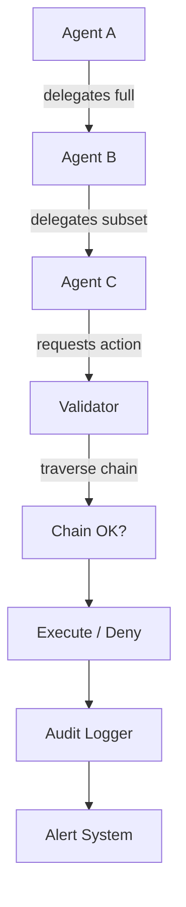

# Agent Delegation Rules and Capability Boundaries (kAI / kOS)

## Agent Context
**For AI Agents**: This document defines the complete delegation system that governs how agents can transfer capabilities and authority to other agents. The DelegationManager is the central authority for all delegation operations. Pay special attention to the impersonation rules and capability inheritance chains.

**Implementation Priority**: Implement DelegationManager first, then validation system, then impersonation controls and audit logging.

## Purpose

To enable:
- Secure and auditable delegation of tasks and permissions
- Controlled impersonation and role inheritance
- Isolation and revocation of delegated authority
- Context-sensitive capability exposure
- Hierarchical trust relationships with proper boundaries

## Architecture

### Directory Structure

```typescript
src/
└── delegation/
    ├── DelegationManager.ts         // Entry point for issuing, validating, and revoking
    ├── CapabilityResolver.ts         // Expands and resolves nested/inherited capabilities
    ├── DelegationValidator.ts       // Runtime checks and limits
    ├── ImpersonationRules.ts        // Constraints on who can act on behalf of whom
    ├── contexts/
    │   ├── ScopedContext.ts        // Defines contextual boundaries (e.g., memory, IO)
    │   └── LifecycleHooks.ts       // Hooks to trigger revocation or escalation
    └── proofs/
        ├── DelegationToken.ts        // Signed, time-limited capabilities
        └── DelegationChain.ts        // Nested, chained multi-party delegation
```

## Core Schema Definitions

### Delegation Envelope

```typescript
interface DelegationEnvelope {
  id: string;                       // Unique delegation identifier
  issuer: AgentIdentity;
  recipient: AgentIdentity;
  capabilities: DelegatedCapability[];
  context?: ExecutionContext;       // Optional execution scope
  constraints: DelegationConstraints;
  issuedAt: string;                 // ISO8601
  expiresAt?: string;               // Optional expiry
  impersonation?: ImpersonationConfig;
  signature: string;                // Ed25519
  chainDepth: number;               // Delegation chain depth
  parentDelegation?: string;        // Parent delegation ID if chained
}

interface DelegatedCapability {
  name: string;                     // e.g., "read:file", "write:log"
  scope: string[];                  // Resource scope limitations
  parameters?: Record<string, any>; // Capability-specific parameters
  inherited: boolean;               // Whether this was inherited from parent
}

interface DelegationConstraints {
  maxDuration?: number;             // Maximum delegation lifetime in seconds
  maxChainDepth?: number;           // Maximum delegation chain depth
  allowedResources?: string[];      // Specific resources this delegation can access
  deniedResources?: string[];       // Resources explicitly denied
  requiresApproval?: boolean;       // Whether delegation requires approval
  revocable: boolean;               // Whether delegation can be revoked
}

interface ImpersonationConfig {
  enabled: boolean;
  maxDuration: number;              // Maximum impersonation time
  scope: 'full' | 'limited';       // Impersonation scope
  auditLevel: 'none' | 'basic' | 'full'; // Audit requirements
}
```

## Delegation Rules Framework

### Core Rules Implementation

```typescript
class DelegationRuleEngine {
  private rules: DelegationRule[] = [
    {
      id: 'R1',
      description: 'Agents may only delegate capabilities they currently hold',
      validate: (delegation: DelegationEnvelope) => this.validateCapabilityOwnership(delegation)
    },
    {
      id: 'R2', 
      description: 'All delegations must be signed using the issuer\'s identity key',
      validate: (delegation: DelegationEnvelope) => this.validateSignature(delegation)
    },
    {
      id: 'R3',
      description: 'No infinite impersonation chains are allowed (max depth = 2)',
      validate: (delegation: DelegationEnvelope) => this.validateChainDepth(delegation)
    },
    {
      id: 'R4',
      description: 'Impersonation must be explicitly requested and declared',
      validate: (delegation: DelegationEnvelope) => this.validateImpersonationDeclaration(delegation)
    },
    {
      id: 'R5',
      description: 'Delegations must be revocable by the issuer at any time',
      validate: (delegation: DelegationEnvelope) => this.validateRevocability(delegation)
    },
    {
      id: 'R6',
      description: 'Expiry timestamps are required for impersonation envelopes',
      validate: (delegation: DelegationEnvelope) => this.validateImpersonationExpiry(delegation)
    },
    {
      id: 'R7',
      description: 'Revoked tokens are blacklisted across trust domains (via KLP)',
      validate: (delegation: DelegationEnvelope) => this.validateRevocationStatus(delegation)
    },
    {
      id: 'R8',
      description: 'Every delegation event is auditable',
      validate: (delegation: DelegationEnvelope) => this.validateAuditability(delegation)
    }
  ];

  async validateDelegation(delegation: DelegationEnvelope): Promise<ValidationResult> {
    const results = await Promise.all(
      this.rules.map(rule => rule.validate(delegation))
    );

    const failures = results.filter(result => !result.valid);
    
    return {
      valid: failures.length === 0,
      failures: failures.map(f => f.reason),
      warnings: results.filter(r => r.warnings).flatMap(r => r.warnings)
    };
  }
}
```

### Impersonation Limitations

```typescript
interface ImpersonationLimitations {
  memory: MemoryAccessRules;
  filesystem: FilesystemAccessRules;
  promptContext: PromptContextRules;
  agentSpawning: AgentSpawningRules;
}

const IMPERSONATION_RULES: ImpersonationLimitations = {
  memory: {
    inheritedAccess: false,
    requiresExplicitSharing: true,
    isolationLevel: 'strict'
  },
  filesystem: {
    accessMode: 'read_only',
    scopeInheritance: 'mirror_issuer',
    pathRestrictions: ['no_system_paths', 'no_config_paths']
  },
  promptContext: {
    visibility: 'hidden',
    requiresReissue: true,
    originalOwnerRequired: true
  },
  agentSpawning: {
    defaultAllowed: false,
    requiresExplicitGrant: true,
    inheritedCapabilities: 'none'
  }
};

class ImpersonationController {
  async validateImpersonationAccess(
    delegation: DelegationEnvelope,
    resource: string,
    action: string
  ): Promise<boolean> {
    if (!delegation.impersonation?.enabled) {
      return false;
    }

    const rules = this.getResourceRules(resource);
    return await this.applyImpersonationRules(delegation, resource, action, rules);
  }

  private async applyImpersonationRules(
    delegation: DelegationEnvelope,
    resource: string,
    action: string,
    rules: ResourceAccessRules
  ): Promise<boolean> {
    // Check time-based constraints
    if (this.isExpired(delegation)) {
      return false;
    }

    // Apply resource-specific rules
    switch (resource) {
      case 'memory':
        return rules.inheritedAccess || delegation.context?.sharedMemory === true;
      case 'filesystem':
        return action === 'read' || delegation.capabilities.some(c => c.name === 'write:filesystem');
      case 'prompt_context':
        return delegation.context?.promptContextShared === true;
      case 'agent_spawning':
        return delegation.capabilities.some(c => c.name === 'spawn:agent');
      default:
        return false;
    }
  }
}
```

## Delegation Chain Management

### Chain Validation

```typescript
class DelegationChain {
  private maxDepth = 3;
  private chains: Map<string, DelegationEnvelope[]> = new Map();

  async validateChain(delegation: DelegationEnvelope): Promise<ChainValidationResult> {
    const chain = await this.buildChain(delegation);
    
    // Check for circular references
    const circularCheck = this.detectCircularReferences(chain);
    if (circularCheck.hasCircular) {
      return { valid: false, reason: 'Circular delegation detected' };
    }

    // Validate all chain links
    const linkValidation = await this.validateAllLinks(chain);
    if (!linkValidation.valid) {
      return linkValidation;
    }

    // Check expiration cascade
    const expirationCheck = this.validateExpirationCascade(chain);
    if (!expirationCheck.valid) {
      return expirationCheck;
    }

    // Enforce least privilege
    const privilegeCheck = this.enforceLeastPrivilege(chain);
    return privilegeCheck;
  }

  private async buildChain(delegation: DelegationEnvelope): Promise<DelegationEnvelope[]> {
    const chain: DelegationEnvelope[] = [delegation];
    let current = delegation;

    while (current.parentDelegation && chain.length < this.maxDepth) {
      const parent = await this.getDelegation(current.parentDelegation);
      if (!parent) break;
      
      chain.unshift(parent);
      current = parent;
    }

    return chain;
  }

  private enforceLeastPrivilege(chain: DelegationEnvelope[]): ChainValidationResult {
    // Each delegation in chain should have subset of capabilities from parent
    for (let i = 1; i < chain.length; i++) {
      const parent = chain[i - 1];
      const child = chain[i];
      
      const invalidCapabilities = child.capabilities.filter(childCap => 
        !parent.capabilities.some(parentCap => 
          this.isCapabilitySubset(childCap, parentCap)
        )
      );

      if (invalidCapabilities.length > 0) {
        return {
          valid: false,
          reason: `Delegation exceeds parent capabilities: ${invalidCapabilities.map(c => c.name).join(', ')}`
        };
      }
    }

    return { valid: true };
  }
}
```

## Enforcement and Validation

### Runtime Enforcement Points

```typescript
class DelegationEnforcer {
  private validator: DelegationValidator;
  private auditLogger: AuditLogger;

  async enforceAtMessageSend(
    sender: AgentIdentity,
    recipient: AgentIdentity,
    message: AgentMessage
  ): Promise<void> {
    const activeDelegations = await this.getActiveDelegations(sender.id);
    
    for (const delegation of activeDelegations) {
      if (delegation.impersonation?.enabled) {
        // Verify impersonation is allowed for this message type
        await this.validateImpersonationMessage(delegation, message);
      }
    }
  }

  async enforceAtResourceAccess(
    agent: AgentIdentity,
    resource: string,
    action: string
  ): Promise<void> {
    const delegations = await this.getActiveDelegations(agent.id);
    
    for (const delegation of delegations) {
      const hasPermission = await this.checkResourcePermission(delegation, resource, action);
      if (!hasPermission) {
        throw new Error(`Delegation ${delegation.id} does not permit ${action} on ${resource}`);
      }
    }
  }

  async enforceAtTaskExecution(
    executor: AgentIdentity,
    task: Task
  ): Promise<void> {
    const delegations = await this.getActiveDelegations(executor.id);
    
    // Check if any delegation covers this task type
    const applicableDelegations = delegations.filter(d => 
      d.capabilities.some(c => this.matchesTaskRequirement(c, task))
    );

    if (applicableDelegations.length === 0) {
      throw new Error(`No valid delegation found for task: ${task.type}`);
    }

    // Log task execution under delegation
    await this.auditLogger.logDelegatedTaskExecution(executor, task, applicableDelegations);
  }
}
```

## Audit and Revocation System

### Comprehensive Auditing

```typescript
interface DelegationAuditEvent {
  id: string;
  type: 'issued' | 'used' | 'revoked' | 'expired' | 'violated';
  delegationId: string;
  timestamp: string;
  actor: AgentIdentity;
  details: Record<string, any>;
  impact: 'low' | 'medium' | 'high' | 'critical';
}

class DelegationAuditor {
  private auditLog: AuditLog;
  private alertSystem: AlertSystem;

  async logDelegationEvent(event: DelegationAuditEvent): Promise<void> {
    // Store in audit log
    await this.auditLog.append(event);

    // Check for suspicious patterns
    await this.analyzeSuspiciousActivity(event);

    // Trigger alerts if necessary
    if (event.impact === 'high' || event.impact === 'critical') {
      await this.alertSystem.triggerAlert(event);
    }
  }

  async generateDelegationReport(agentId: string): Promise<DelegationReport> {
    const events = await this.auditLog.getEventsForAgent(agentId);
    const activeDelegations = await this.getActiveDelegations(agentId);
    
    return {
      agentId,
      totalDelegations: events.filter(e => e.type === 'issued').length,
      activeDelegations: activeDelegations.length,
      violations: events.filter(e => e.type === 'violated').length,
      riskScore: this.calculateRiskScore(events),
      recommendations: this.generateRecommendations(events)
    };
  }
}
```

### Revocation System

```typescript
class DelegationRevocationManager {
  async revokeDelegation(
    delegationId: string,
    revoker: AgentIdentity,
    reason: string
  ): Promise<void> {
    const delegation = await this.getDelegation(delegationId);
    if (!delegation) {
      throw new Error(`Delegation not found: ${delegationId}`);
    }

    // Verify revocation authority
    if (delegation.issuer.id !== revoker.id && !this.hasRevocationAuthority(revoker, delegation)) {
      throw new Error('Insufficient authority to revoke delegation');
    }

    // Create revocation record
    const revocation: DelegationRevocation = {
      id: generateUUID(),
      delegationId,
      revokedBy: revoker,
      reason,
      timestamp: new Date().toISOString(),
      signature: await this.signRevocation(revoker, delegationId, reason)
    };

    // Store revocation
    await this.storeRevocation(revocation);

    // Propagate revocation across trust domains
    await this.propagateRevocation(revocation);

    // Audit the revocation
    await this.auditLogger.logRevocation(revocation);
  }

  private async propagateRevocation(revocation: DelegationRevocation): Promise<void> {
    // Local blacklist
    await this.addToBlacklist(revocation.delegationId);

    // KLP propagation
    const klpMessage = {
      type: 'delegation_revocation',
      revocation,
      timestamp: new Date().toISOString()
    };

    await this.klpClient.broadcast(klpMessage);
  }
}
```

## Visual Flow and Architecture

The delegation system follows this flow:



## Future Enhancements

| Feature | Target Version | Description |
|---------|----------------|-------------|
| zkDelegation proof-of-capability | v1.3 | Zero-knowledge proofs for delegation verification |
| DAO endorsement-based delegation | v1.5 | Community governance for high-privilege delegations |
| UI Delegation Grant Manager | v2.0 | Graphical interface for delegation management |
| ML-based anomaly detection | v2.1 | AI-powered detection of delegation abuse |
| Cross-domain delegation | v2.2 | Delegations across different kOS instances |

## Implementation Guidelines

### Development Phases

1. **Phase 1**: Core DelegationManager and basic validation
2. **Phase 2**: Impersonation controls and chain validation
3. **Phase 3**: Comprehensive auditing and revocation
4. **Phase 4**: Advanced security features and UI
5. **Phase 5**: Federation and cross-domain capabilities

### Security Considerations

- All delegations must be cryptographically signed
- Impersonation must be time-limited and audited
- Chain depth must be strictly enforced
- Revocation must be immediate and tamper-proof
- Audit logs must be encrypted and immutable

This delegation system forms the backbone of secure agent-to-agent capability transfer in kAI/kOS while preserving auditability, least privilege, and the principle of revocation-first authorization.