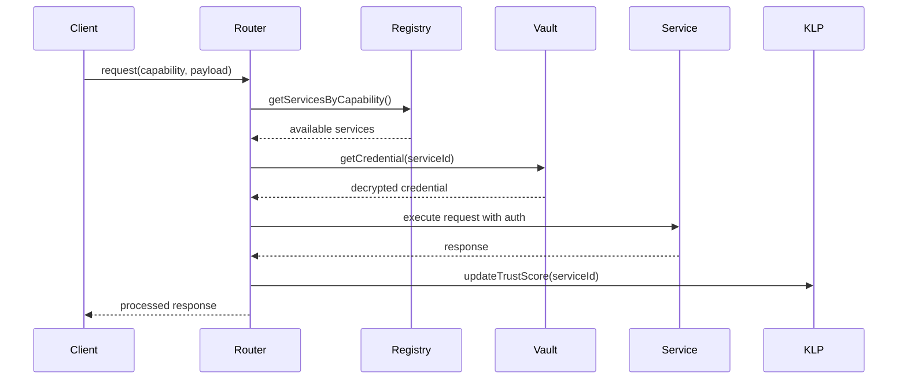

# Service Manager Stack and KindLink Protocol

## Agent Context
This document specifies the complete service management architecture for kAI/kOS systems. Agents should understand this as the central orchestration layer for all external service integrations, providing secure credential management, capability-based routing, and KLP federation support. The service manager ensures modularity, interchangeability, and secure routing for all service interactions.

## Purpose and Scope

The Service Manager Stack coordinates all aspects of service integration:
- **Service Registration**: Dynamic discovery and registration of local and remote services
- **Credential Management**: Secure vaulting and access control for service authentication
- **API Normalization**: Unified interface across diverse service types and protocols
- **KLP Integration**: KindLink Protocol routing, discovery, and federation
- **Capability Routing**: Dynamic service selection based on required capabilities

## Architecture Overview

The service manager implements a layered architecture with clear separation of concerns:

```text
┌─────────────────────────────────────┐
│           Service API Layer         │ ← Unified interface for all services
├─────────────────────────────────────┤
│         Capability Router           │ ← Dynamic routing based on capabilities
├─────────────────────────────────────┤
│        Middleware Pipeline          │ ← Logging, caching, rate limiting, ACL
├─────────────────────────────────────┤
│       Service Registry              │ ← Service discovery and registration
├─────────────────────────────────────┤
│      Credential Vault               │ ← Secure credential storage and access
├─────────────────────────────────────┤
│        KLP Integration              │ ← KindLink Protocol federation
└─────────────────────────────────────┘
```

## Directory Structure

```text
src/
└── services/
    ├── index.ts                        # Entry point for dynamic service loading
    ├── registry/                       # All registered connectors
    │   ├── openai.ts                   # OpenAI service handler
    │   ├── ollama.ts                   # Ollama local runtime
    │   ├── chromadb.ts                 # Chroma DB service
    │   ├── anthropic.ts                # Claude handler
    │   ├── huggingface.ts              # Hugging Face API wrapper
    │   ├── stability.ts                # Stability AI image generation
    │   ├── comfyui.ts                  # ComfyUI local workflow engine
    │   ├── automatic1111.ts            # A1111 local image generation
    │   └── index.ts                    # Registry aggregation and exports
    ├── vault/
    │   ├── CredentialManager.ts        # Secure secret interface
    │   ├── VaultClient.ts              # Low-level crypto vault client
    │   └── VaultTypes.ts               # Type definitions for vault operations
    ├── dispatcher/
    │   ├── Router.ts                   # Dynamic route resolution (by capability)
    │   ├── Middleware.ts               # Middleware hooks for logging, caching, ACL
    │   └── LoadBalancer.ts             # Service load balancing and health checks
    ├── klp/
    │   ├── KLPClient.ts                # KindLink Protocol client implementation
    │   ├── Discovery.ts                # Service discovery via KLP
    │   ├── Federation.ts               # Cross-system service federation
    │   └── TrustVerification.ts        # Service trust and signature verification
    └── types/
        ├── ServiceDefinition.ts        # Universal service schema
        ├── CapabilitySchema.ts         # Capability types: chat, gen, vector
        ├── AuthSchema.ts               # Auth modes: none, bearer, api_key
        └── KLPTypes.ts                 # KindLink Protocol type definitions
```

## Service Definition Schema

```typescript
interface ServiceDefinition {
  id: string;                         // Unique service identifier
  name: string;                       // Human-readable display name
  description: string;                // Service description and purpose
  version: string;                    // Service version for compatibility
  baseUrl: string;                    // Base URL for API endpoints
  auth: AuthConfig;                   // Authentication configuration
  capabilities: Capability[];         // Supported capabilities array
  isLocal: boolean;                   // Local runtime vs remote service
  status: ServiceStatus;              // Current operational status
  metadata: ServiceMetadata;          // Additional service information
  tags?: string[];                    // For grouping and UI filters
  klp?: KLPConfig;                    // KindLink Protocol configuration
}

interface ServiceMetadata {
  provider: string;                   // Service provider name
  homepage?: string;                  // Provider homepage URL
  documentation?: string;             // API documentation URL
  supportContact?: string;            // Support contact information
  rateLimit?: RateLimitConfig;        // Rate limiting information
  healthCheck?: HealthCheckConfig;    // Health monitoring configuration
}

interface KLPConfig {
  enabled: boolean;                   // KLP federation enabled
  trustScore?: number;                // Service trust score
  signature?: string;                 // Service signature for verification
  federationEndpoints?: string[];     // KLP federation endpoints
}

enum ServiceStatus {
  ACTIVE = 'active',
  INACTIVE = 'inactive',
  ERROR = 'error',
  MAINTENANCE = 'maintenance',
  UNKNOWN = 'unknown'
}
```

## Capability System

The capability system enables dynamic service selection based on required functionality:

```typescript
// CapabilitySchema.ts
export type Capability = 
  | ChatCapability 
  | VectorCapability 
  | ImageGenCapability 
  | AudioCapability 
  | EmbeddingCapability;

interface ChatCapability {
  type: 'chat';
  endpoints: {
    chat: string;                     // Chat completion endpoint
    models: string;                   // Available models endpoint
    stream?: string;                  // Streaming endpoint (optional)
  };
  parameters: ChatParameter[];        // Supported parameters
  models: ModelInfo[];                // Available models
  streaming: boolean;                 // Streaming support
  contextWindow: number;              // Maximum context window
}

interface VectorCapability {
  type: 'vector';
  endpoints: {
    query: string;                    // Vector similarity search
    insert: string;                   // Vector insertion
    delete: string;                   // Vector deletion
    collections?: string;             // Collection management
  };
  dimensions: number[];               // Supported vector dimensions
  metrics: DistanceMetric[];          // Supported distance metrics
  indexTypes: IndexType[];            // Supported index types
}

interface ImageGenCapability {
  type: 'image_gen';
  endpoints: {
    generate: string;                 // Image generation endpoint
    models?: string;                  // Available models
    styles?: string;                  // Available styles
  };
  parameters: ImageGenParameter[];    // Generation parameters
  formats: ImageFormat[];             // Supported output formats
  maxResolution: Resolution;          // Maximum output resolution
}

interface ChatParameter {
  name: string;
  type: 'number' | 'string' | 'boolean' | 'array';
  required: boolean;
  default?: any;
  min?: number;
  max?: number;
  options?: string[];
  description: string;
}
```

## Authentication Framework

```typescript
// AuthSchema.ts
export type AuthConfig = 
  | NoAuthConfig 
  | BearerTokenConfig 
  | ApiKeyConfig 
  | OAuthConfig 
  | CustomAuthConfig;

interface NoAuthConfig {
  type: 'none';
}

interface BearerTokenConfig {
  type: 'bearer';
  tokenSource: 'vault' | 'env' | 'config';
  tokenKey: string;                   // Vault key or env variable name
  headerName?: string;                // Custom header name (default: Authorization)
}

interface ApiKeyConfig {
  type: 'api_key';
  keySource: 'vault' | 'env' | 'config';
  keyName: string;                    // Vault key or env variable name
  location: 'header' | 'query' | 'body';
  parameterName: string;              // Header/query/body parameter name
}

interface OAuthConfig {
  type: 'oauth';
  clientId: string;
  clientSecret: string;
  authUrl: string;
  tokenUrl: string;
  scopes: string[];
  redirectUri?: string;
}

interface CustomAuthConfig {
  type: 'custom';
  handler: string;                    // Custom auth handler function name
  config: Record<string, any>;        // Handler-specific configuration
}
```

## Service Registry Implementation

```typescript
// src/services/registry/index.ts
class ServiceRegistry {
  private services: Map<string, ServiceDefinition> = new Map();
  private capabilityIndex: Map<string, Set<string>> = new Map();
  private statusCache: Map<string, ServiceStatus> = new Map();

  async registerService(service: ServiceDefinition): Promise<void> {
    // Validate service definition
    await this.validateServiceDefinition(service);
    
    // Store service
    this.services.set(service.id, service);
    
    // Index by capabilities
    for (const capability of service.capabilities) {
      if (!this.capabilityIndex.has(capability.type)) {
        this.capabilityIndex.set(capability.type, new Set());
      }
      this.capabilityIndex.get(capability.type)!.add(service.id);
    }
    
    // Initialize health monitoring
    await this.initializeHealthCheck(service);
    
    // Register with KLP if enabled
    if (service.klp?.enabled) {
      await this.klpClient.registerService(service);
    }
    
    this.emit('serviceRegistered', service);
  }

  async discoverServices(capability?: string): Promise<ServiceDefinition[]> {
    let serviceIds: string[];
    
    if (capability) {
      serviceIds = Array.from(this.capabilityIndex.get(capability) || []);
    } else {
      serviceIds = Array.from(this.services.keys());
    }
    
    const services = serviceIds
      .map(id => this.services.get(id)!)
      .filter(service => service.status === ServiceStatus.ACTIVE);
    
    // Include KLP discovered services
    if (capability) {
      const klpServices = await this.klpClient.discoverServices(capability);
      services.push(...klpServices);
    }
    
    return services;
  }

  async getServicesByCapability(capability: string): Promise<ServiceDefinition[]> {
    const serviceIds = this.capabilityIndex.get(capability) || new Set();
    return Array.from(serviceIds)
      .map(id => this.services.get(id)!)
      .filter(service => service && service.status === ServiceStatus.ACTIVE)
      .sort((a, b) => (b.klp?.trustScore || 0) - (a.klp?.trustScore || 0));
  }

  async updateServiceStatus(serviceId: string, status: ServiceStatus): Promise<void> {
    const service = this.services.get(serviceId);
    if (service) {
      service.status = status;
      this.statusCache.set(serviceId, status);
      this.emit('serviceStatusChanged', { serviceId, status });
    }
  }

  private async validateServiceDefinition(service: ServiceDefinition): Promise<void> {
    const schema = ServiceDefinitionSchema;
    const result = schema.safeParse(service);
    
    if (!result.success) {
      throw new ServiceValidationError(
        `Invalid service definition for ${service.id}`,
        result.error.errors
      );
    }
  }
}
```

## Dynamic Router Implementation

```typescript
// src/services/dispatcher/Router.ts
interface RouteRequest {
  capability: string;
  payload: any;
  preferences?: ServicePreferences;
  context?: RequestContext;
}

interface ServicePreferences {
  preferLocal?: boolean;
  excludeServices?: string[];
  requireTrustScore?: number;
  maxLatency?: number;
  costPreference?: 'lowest' | 'balanced' | 'performance';
}

class ServiceRouter {
  private registry: ServiceRegistry;
  private loadBalancer: LoadBalancer;
  private middleware: MiddlewarePipeline;

  async route(request: RouteRequest): Promise<ServiceResponse> {
    // Find services matching capability
    const candidates = await this.registry.getServicesByCapability(request.capability);
    
    // Apply preferences and filters
    const filtered = this.applyPreferences(candidates, request.preferences);
    
    if (filtered.length === 0) {
      throw new NoServiceAvailableError(`No services available for capability: ${request.capability}`);
    }
    
    // Select service using load balancing
    const selectedService = await this.loadBalancer.selectService(filtered, request);
    
    // Execute request through middleware pipeline
    return await this.middleware.execute(selectedService, request);
  }

  private applyPreferences(
    services: ServiceDefinition[], 
    preferences?: ServicePreferences
  ): ServiceDefinition[] {
    if (!preferences) return services;

    return services.filter(service => {
      // Local preference
      if (preferences.preferLocal && !service.isLocal) return false;
      
      // Exclusion list
      if (preferences.excludeServices?.includes(service.id)) return false;
      
      // Trust score requirement
      if (preferences.requireTrustScore && 
          (service.klp?.trustScore || 0) < preferences.requireTrustScore) {
        return false;
      }
      
      return true;
    });
  }
}
```

## Credential Vault Integration

```typescript
// src/services/vault/CredentialManager.ts
interface ServiceCredential {
  serviceId: string;
  credentialType: string;
  encryptedValue: string;
  metadata: {
    created: string;
    lastUsed: string;
    expiresAt?: string;
    rotationPolicy?: string;
  };
}

class CredentialManager {
  private vault: VaultClient;
  private credentialCache: Map<string, any> = new Map();

  async storeCredential(
    serviceId: string, 
    credentialType: string, 
    value: string,
    options?: CredentialOptions
  ): Promise<void> {
    const credential: ServiceCredential = {
      serviceId,
      credentialType,
      encryptedValue: await this.vault.encrypt(value),
      metadata: {
        created: new Date().toISOString(),
        lastUsed: new Date().toISOString(),
        expiresAt: options?.expiresAt,
        rotationPolicy: options?.rotationPolicy
      }
    };
    
    await this.vault.store(`service:${serviceId}:${credentialType}`, credential);
    this.invalidateCache(serviceId, credentialType);
  }

  async getCredential(serviceId: string, credentialType: string): Promise<string> {
    const cacheKey = `${serviceId}:${credentialType}`;
    
    if (this.credentialCache.has(cacheKey)) {
      return this.credentialCache.get(cacheKey);
    }
    
    const credential = await this.vault.retrieve(`service:${serviceId}:${credentialType}`) as ServiceCredential;
    
    if (!credential) {
      throw new CredentialNotFoundError(`Credential not found for service ${serviceId}`);
    }
    
    // Check expiration
    if (credential.metadata.expiresAt && 
        new Date(credential.metadata.expiresAt) < new Date()) {
      throw new CredentialExpiredError(`Credential expired for service ${serviceId}`);
    }
    
    const decryptedValue = await this.vault.decrypt(credential.encryptedValue);
    
    // Update last used timestamp
    credential.metadata.lastUsed = new Date().toISOString();
    await this.vault.store(`service:${serviceId}:${credentialType}`, credential);
    
    // Cache for performance
    this.credentialCache.set(cacheKey, decryptedValue);
    
    return decryptedValue;
  }

  async rotateCredential(serviceId: string, credentialType: string): Promise<void> {
    // Implementation depends on service-specific rotation logic
    const service = await this.registry.getService(serviceId);
    const rotationHandler = this.getRotationHandler(service);
    
    if (rotationHandler) {
      const newCredential = await rotationHandler.rotate(serviceId, credentialType);
      await this.storeCredential(serviceId, credentialType, newCredential);
    }
  }
}
```

## KindLink Protocol Integration

```typescript
// src/services/klp/KLPClient.ts
interface KLPServiceAnnouncement {
  serviceId: string;
  host: string;
  capabilities: string[];
  version: string;
  trustScore: number;
  signature: string;
  metadata: {
    provider: string;
    lastSeen: string;
    endpoints: Record<string, string>;
  };
}

class KLPClient {
  private federationEndpoints: string[];
  private trustVerifier: TrustVerification;

  async registerService(service: ServiceDefinition): Promise<void> {
    const announcement: KLPServiceAnnouncement = {
      serviceId: service.id,
      host: service.baseUrl,
      capabilities: service.capabilities.map(c => c.type),
      version: service.version,
      trustScore: service.klp?.trustScore || 0,
      signature: await this.signAnnouncement(service),
      metadata: {
        provider: service.metadata.provider,
        lastSeen: new Date().toISOString(),
        endpoints: this.extractEndpoints(service)
      }
    };

    // Publish to all federation endpoints
    await Promise.all(
      this.federationEndpoints.map(endpoint => 
        this.publishAnnouncement(endpoint, announcement)
      )
    );
  }

  async discoverServices(capability: string): Promise<ServiceDefinition[]> {
    const discoveries = await Promise.all(
      this.federationEndpoints.map(endpoint => 
        this.queryServices(endpoint, capability)
      )
    );

    const allServices = discoveries.flat();
    
    // Verify trust and signatures
    const verifiedServices = await Promise.all(
      allServices.map(async service => {
        const isValid = await this.trustVerifier.verifyService(service);
        return isValid ? service : null;
      })
    );

    return verifiedServices.filter(s => s !== null) as ServiceDefinition[];
  }

  async verifyServiceTrust(serviceId: string): Promise<TrustVerificationResult> {
    const trustChain = await this.getTrustChain(serviceId);
    return await this.trustVerifier.verifyTrustChain(trustChain);
  }

  private async signAnnouncement(service: ServiceDefinition): Promise<string> {
    const payload = {
      serviceId: service.id,
      capabilities: service.capabilities.map(c => c.type),
      timestamp: Date.now()
    };
    
    return await this.cryptoService.sign(JSON.stringify(payload));
  }

  private async publishAnnouncement(
    endpoint: string, 
    announcement: KLPServiceAnnouncement
  ): Promise<void> {
    try {
      await fetch(`${endpoint}/klp/register`, {
        method: 'POST',
        headers: { 'Content-Type': 'application/json' },
        body: JSON.stringify(announcement)
      });
    } catch (error) {
      console.warn(`Failed to publish to KLP endpoint ${endpoint}:`, error);
    }
  }
}
```

## Middleware Pipeline

```typescript
// src/services/dispatcher/Middleware.ts
interface MiddlewareHook {
  name: string;
  priority: number;
  onRequest?(req: ServiceRequest): Promise<ServiceRequest>;
  onResponse?(res: ServiceResponse): Promise<ServiceResponse>;
  onError?(err: Error, req: ServiceRequest): Promise<ServiceResponse | void>;
  filter?(service: ServiceDefinition): boolean;
}

class MiddlewarePipeline {
  private hooks: MiddlewareHook[] = [];

  registerMiddleware(hook: MiddlewareHook): void {
    this.hooks.push(hook);
    this.hooks.sort((a, b) => b.priority - a.priority);
  }

  async execute(service: ServiceDefinition, request: RouteRequest): Promise<ServiceResponse> {
    let processedRequest = { ...request, service };
    
    // Execute onRequest hooks
    for (const hook of this.hooks) {
      if (hook.filter && !hook.filter(service)) continue;
      
      if (hook.onRequest) {
        processedRequest = await hook.onRequest(processedRequest);
      }
    }
    
    try {
      // Execute the actual service call
      const response = await this.callService(service, processedRequest);
      
      // Execute onResponse hooks
      let processedResponse = response;
      for (const hook of this.hooks.reverse()) {
        if (hook.filter && !hook.filter(service)) continue;
        
        if (hook.onResponse) {
          processedResponse = await hook.onResponse(processedResponse);
        }
      }
      
      return processedResponse;
    } catch (error) {
      // Execute onError hooks
      for (const hook of this.hooks) {
        if (hook.filter && !hook.filter(service)) continue;
        
        if (hook.onError) {
          const errorResponse = await hook.onError(error, processedRequest);
          if (errorResponse) return errorResponse;
        }
      }
      
      throw error;
    }
  }
}

// Built-in middleware implementations
export const LoggingMiddleware: MiddlewareHook = {
  name: 'logging',
  priority: 100,
  async onRequest(req) {
    console.log(`Service request: ${req.service.id} - ${req.capability}`);
    return req;
  },
  async onResponse(res) {
    console.log(`Service response: ${res.service.id} - ${res.status}`);
    return res;
  }
};

export const RetryMiddleware: MiddlewareHook = {
  name: 'retry',
  priority: 90,
  async onError(err, req) {
    if (this.shouldRetry(err) && req.retryCount < 3) {
      req.retryCount = (req.retryCount || 0) + 1;
      await this.delay(Math.pow(2, req.retryCount) * 1000);
      // Return null to continue with retry
      return null;
    }
    throw err;
  }
};
```

## Supported Services Baseline

| Service ID      | Type        | Auth        | Capabilities              | Notes                        |
|----------------|-------------|-------------|---------------------------|------------------------------|
| openai         | chat        | bearer      | chat, embeddings          | GPT-3.5/4 via API          |
| ollama         | chat        | none        | chat, embeddings          | Local model runtime         |
| anthropic      | chat        | bearer      | chat                      | Claude models               |
| chroma         | vector      | none        | vector                    | Local vector database       |
| qdrant         | vector      | api_key     | vector                    | High-performance vector DB   |
| huggingface    | chat/gen    | bearer      | chat, image_gen          | Hosted transformers         |
| stability      | image_gen   | bearer      | image_gen                | Stable Diffusion API        |
| comfyui        | image_gen   | none        | image_gen                | Local workflow engine       |
| automatic1111  | image_gen   | none        | image_gen                | Local SD web UI             |
| elevenlabs     | audio       | bearer      | text_to_speech           | Voice synthesis             |

## Service Lifecycle Management



## Implementation Status

- **Current**: Basic service registration and capability routing
- **Planned**: Full KLP integration, advanced middleware, credential rotation
- **Future**: AI-powered service optimization, federated trust networks

This service manager architecture provides the foundation for scalable, secure, and intelligent service orchestration across the kAI/kOS ecosystem.
